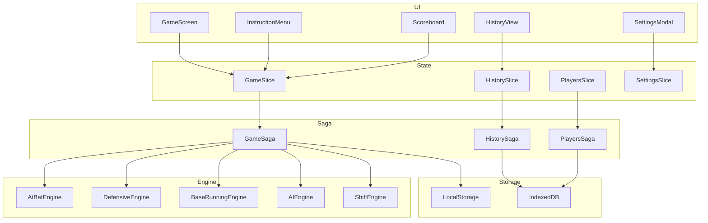
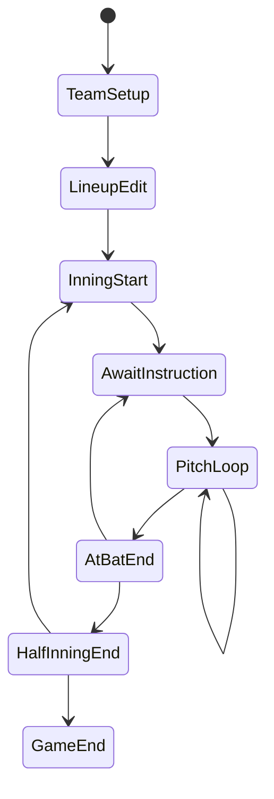
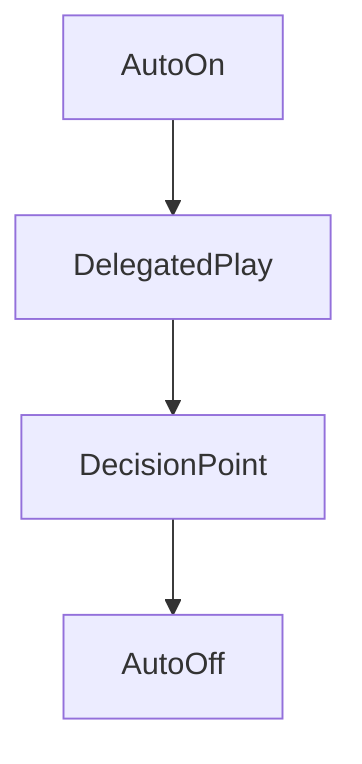
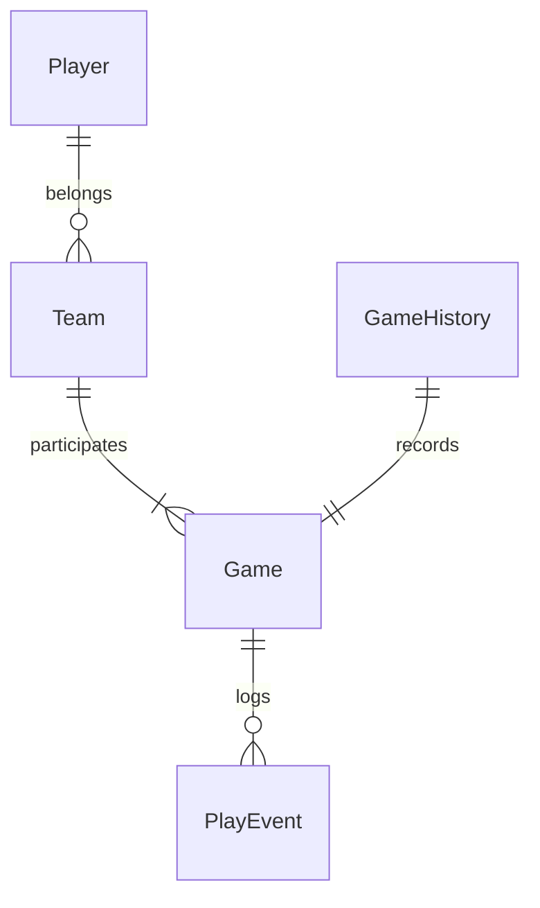
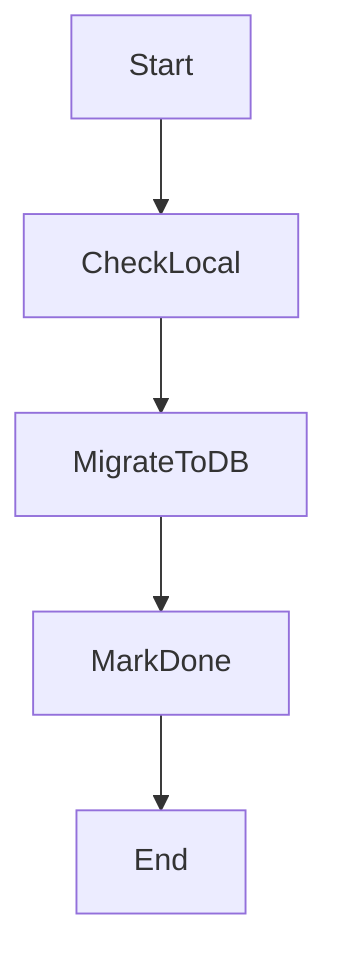

# テクニカルデザインドキュメント

## Overview
本機能は、ブラウザ上で動作する野球監督シミュレーションに対し、1球単位判定・指示待機・AI委譲・表示モードなどの詳細要件を満たすための設計を定義する。既存の`features/baseball`実装を拡張し、ゲームフロー制御と永続化を強化する。

対象ユーザーは野球シミュレーションのプレイヤーであり、打席ごとの戦術指示と試合状況の可視化を必要とする。現行のRTKベース構成を維持しつつ、SagaとIndexedDB導入で非同期制御とデータ永続化の信頼性を高める。

### Goals
- 1球判定ループとカウント補正を正確に反映した打席進行を提供する
- 意思決定ポイントでの指示待機とAI委譲モードを両立する
- 試合履歴/選手データの永続化と再開フローを安定化する

### Non-Goals
- マルチプレイヤー対戦やオンライン同期
- 実在選手データの配布
- シーズンモードやリーグ運用機能

## Architecture

### Existing Architecture Analysis
- `features/baseball`配下に`gameSlice`と各種エンジンが存在し、UIは直接状態操作を行う構成
- 永続化はlocalStorage中心で、IndexedDBは未導入
- 1球判定・AI・守備シフトのエンジンは純粋関数として分離されている
- ステアリングはRedux SagaとIndexedDB採用を推奨する

### Architecture Pattern & Boundary Map



**Architecture Integration**:
- 選択パターン: Feature First + Redux Saga + エンジン分離
- ドメイン境界: Game/Players/History/Settingsを明確に分離
- 既存パターン保持: RTK sliceと純粋関数エンジン
- 新規コンポーネント根拠: GameSaga/IndexedDBServiceは複雑フローと永続化のために必要
- ステアリング準拠: Redux SagaとIndexedDBの採用方針に整合

### Technology Stack

| Layer | Choice / Version | Role in Feature | Notes |
|-------|------------------|-----------------|-------|
| Frontend | React 18.3 + Vite 5.4 | 画面/状態反映 | 既存スタック |
| State | Redux Toolkit + Redux Saga | ゲームフロー制御 | Saga追加 |
| Data | Dexie 3.2+ | IndexedDB永続化 | 新規依存 |
| Storage | localStorage | 設定/自動保存 | 既存維持 |
| Runtime | Browser | オフライン動作 | 既存方針 |

## System Flows

### 試合進行と指示待機



- 指示待機は意思決定ポイントでのみ発生し、オートモード時はAI委譲でスキップする
- PitchLoopは詳細/簡易表示に応じて表示方式のみ変更し、判定自体は共通化する
- フェーズ遷移はGameSagaが所有し、UIはイベント発火のみを行う

### オートモード解除フロー



- Escまたは中断操作で即時解除し、次の意思決定ポイントから手動に戻る

## Requirements Traceability

| Requirement | Summary | Components | Interfaces | Flows |
|-------------|---------|------------|------------|-------|
| 1.1-1.18 | 試合開始と進行 | GameSlice, GameSaga, GameScreen | GameState, GameFlowService | 試合進行 |
| 2.1-2.52 | 指示待機/オートモード/指示UI | GameSaga, InstructionMenu, SettingsSlice | DecisionPoint, AutoModeState | 試合進行/オート解除 |
| 3.1-3.272 | 1球判定と守備/走塁 | AtBatEngine, DefensiveEngine, BaseRunningEngine | SimulationEngine | 試合進行 |
| 4.1-4.123 | 選手/チーム管理 | PlayersSlice, PlayersSaga | PlayerRepository | - |
| 5.1-5.46 | 試合状況の可視化 | Scoreboard, PlayLog, PitchDisplay | DisplayState | - |
| 6.1-6.25 | 勝敗判定 | GameSaga | GameResult | - |
| 7.1-7.30 | エラーハンドリング | LocalStorageService, ErrorBoundary | SaveState | - |
| 8.1-8.40 | 履歴/戦績 | HistorySlice, HistorySaga | HistoryRepository | - |
| 9.1-9.72 | データ管理/インポート | PlayersSaga, ImportExportService | ImportExportContract | - |
| 10.1-10.115 | CPU AI/委譲 | AIEngine, GameSaga | AIService | 試合進行 |
| 11.1-11.56 | 守備シフト | ShiftEngine, InstructionMenu | ShiftPolicy | - |

## Components and Interfaces

### サマリー
| Component | Domain/Layer | Intent | Req Coverage | Key Dependencies | Contracts |
|-----------|-------------|--------|--------------|------------------|----------|
| GameSlice | State | 試合状態を保持 | 1.1-1.18, 2.1-2.52, 5.1-5.46 | GameSaga P0 | State |
| GameSaga | Saga | フロー制御とエンジン統合 | 1.1-1.18, 2.1-2.52, 3.1-3.272, 6.1-6.25 | Engines P0, LocalStorage P0 | Service |
| SimulationEngine | Engine | 打席/守備/走塁判定 | 3.1-3.272 | ProbabilityEngine P0 | Service |
| AIEngine | Engine | CPU判断とAI委譲 | 10.1-10.115 | - | Service |
| IndexedDBService | Storage | 選手/履歴永続化 | 4.1-4.123, 8.1-8.40, 9.1-9.72 | Dexie P0 | Service |
| LocalStorageService | Storage | 設定/自動保存 | 7.1-7.30 | - | Service |
| InstructionMenu | UI | 指示選択UI | 2.1-2.52 | GameSlice P0 | State |
| Scoreboard | UI | スコア/カウント表示 | 5.1-5.46 | GameSlice P0 | State |
| PitchDisplay | UI | 投球表示モードの反映 | 2.20-2.23, 5.31-5.46 | GameSlice P0 | State |

### Saga Layer

#### GameSaga
| Field | Detail |
|-------|--------|
| Intent | 試合進行・指示待機・AI委譲を統合制御する |
| Requirements | 1.1-1.18, 2.1-2.52, 3.1-3.272, 6.1-6.25 |

**Responsibilities & Constraints**
- フェーズ遷移の単一所有者として進行を制御する
- 指示待機とオートモードの分岐制御
- 1球判定ループと結果反映の順序保証
- 自動保存/試合終了保存のトリガー

**Dependencies**
- Inbound: GameSlice — 状態更新 (P0)
- Outbound: SimulationEngine — 判定実行 (P0)
- Outbound: AIEngine — 指示決定 (P0)
- Outbound: LocalStorageService — 自動保存 (P0)

**Contracts**: Service [x] / API [ ] / Event [ ] / Batch [ ] / State [ ]

##### Service Interface
```typescript
interface GameFlowService {
  startGame(input: StartGameInput): void;
  awaitDecisionPoint(point: DecisionPointType): void;
  resolveInstruction(input: InstructionInput): void;
  applyPlayResult(result: PlayResult): void;
  endGame(result: GameResult): void;
}
```
- Preconditions: GameStateが有効
- Postconditions: フェーズ遷移とログが整合
- Invariants: 指示待機は意思決定ポイントのみ

### Engine Layer

#### SimulationEngine
| Field | Detail |
|-------|--------|
| Intent | 1球判定と守備/走塁判定を実行する |
| Requirements | 3.1-3.272 |

**Responsibilities & Constraints**
- 1球判定ループとカウント補正
- インプレー後の守備判定と進塁判定
- 副作用を持たない純粋関数

**Dependencies**
- Inbound: GameSaga — 判定要求 (P0)
- Outbound: ProbabilityEngine — 確率計算 (P0)

**Contracts**: Service [x] / API [ ] / Event [ ] / Batch [ ] / State [ ]

##### Service Interface
```typescript
interface SimulationEngine {
  simulateAtBat(input: AtBatInput): AtBatResult;
  simulateAtBatWithPitchLoop(input: AtBatInput): AtBatWithPitchResult;
  simulateSteal(input: StealInput): StealResult;
  calculateAdvancement(input: AdvancementInput): AdvancementResult;
}
```
- Preconditions: 入力選手/状態が有効
- Postconditions: 結果が確定し状態更新が可能
- Invariants: 入力を変更しない

#### AIEngine
| Field | Detail |
|-------|--------|
| Intent | CPU判断とAI委譲の意思決定を提供する |
| Requirements | 10.1-10.115 |

**Responsibilities & Constraints**
- 難易度とカウント状況に基づく指示決定
- AI委譲時の推奨理由の生成
- 思考時間はGameSaga側で付与

**Dependencies**
- Inbound: GameSaga — 判断要求 (P0)
- Outbound: なし

**Contracts**: Service [x] / API [ ] / Event [ ] / Batch [ ] / State [ ]

##### Service Interface
```typescript
interface AIService {
  decideOffense(input: AIOffenseInput): AIDecision;
  decideDefense(input: AIDefenseInput): AIDecision;
  delegate(input: AIDelegationInput): AIDecision;
}
```

### Storage Layer

#### IndexedDBService
| Field | Detail |
|-------|--------|
| Intent | 選手/履歴をIndexedDBに永続化する |
| Requirements | 4.1-4.123, 8.1-8.40, 9.1-9.72 |

**Responsibilities & Constraints**
- SoTはIndexedDBとし、選手/履歴はIndexedDBに集約する
- Dexieでのテーブル定義とCRUD
- 初回起動時のlocalStorage移行（片方向・冪等）

**Dependencies**
- Inbound: PlayersSaga, HistorySaga — CRUD (P0)
- External: Dexie — IndexedDBラッパー (P0)

**Contracts**: Service [x] / API [ ] / Event [ ] / Batch [ ] / State [ ]

##### Service Interface
```typescript
interface IndexedDBService {
  getPlayers(): Promise<Player[]>;
  savePlayer(player: Player): Promise<void>;
  getHistory(): Promise<GameHistoryRecord[]>;
  saveHistory(record: GameHistoryRecord): Promise<void>;
}
```

#### LocalStorageService
| Field | Detail |
|-------|--------|
| Intent | 設定と一時保存を管理する |
| Requirements | 7.1-7.30 |

**Responsibilities & Constraints**
- 設定の読み書き
- 自動保存/復元のトリガー
- IndexedDB移行後は設定/一時保存のみを保持する

**Dependencies**
- Inbound: GameSaga, SettingsSlice — 保存要求 (P0)

**Contracts**: Service [x] / API [ ] / Event [ ] / Batch [ ] / State [ ]

##### Service Interface
```typescript
interface LocalStorageService {
  loadSettings(): UserSettings;
  saveSettings(settings: UserSettings): void;
  saveAutoGame(state: GameState): void;
  loadAutoGame(): GameState | null;
}
```

### State Management

**GameStateの主要追加フィールド**
- `decisionPoint: DecisionPointType | null`
- `autoModeScope: AutoModeScope | null`
- `isAutoModeActive: boolean`

**遷移責務**
- すべてのフェーズ遷移はGameSagaが所有する
- UIはアクション発火のみを行い、直接フェーズを更新しない

```typescript
type DecisionPointType =
  | 'offense_instruction'
  | 'defense_instruction'
  | 'substitution'
  | 'lineup_edit'
  | 'team_selection';

type AutoModeScope = 'at_bat' | 'inning' | 'game' | 'always';
```

## Data Models

### Domain Model
- Player, Team, Game, GameHistoryを集約として扱う
- GameはAtBat/PlayEventを内包する



### Logical Data Model
- Player: 能力値（1-100）と状態（condition, fatigue）を保持
- Team: rosterとdefaultLineupを保持
- GameHistory: スコア、イニング別得点、ハイライトを保持

### Physical Data Model
- IndexedDB: players, teams, historyテーブル
- localStorage: settings, autoSave, crashInfo

**SoT方針**
- 選手/履歴はIndexedDBを唯一のSoTとする
- localStorageは設定と一時保存のみを保持する

## Error Handling

### Error Strategy
- ユーザーエラーは即時フィードバックし状態を維持する
- システムエラーは自動保存と復旧ダイアログを優先する

### Error Categories and Responses
- User Errors: 無効指示や不正入力は警告と再選択
- System Errors: 保存失敗は再試行ガイド、クラッシュ時は復元提案
- Business Logic Errors: ルール違反は理由表示と状態維持

### Monitoring
- エラーはconsoleログとクラッシュ情報保存を併用する

## Testing Strategy

### Unit Tests
- 1球判定の確率補正
- AI判断の難易度分岐
- 進塁判定ロジック

### Integration Tests
- 指示待機→1球判定→結果反映の一連フロー
- オートモードの開始/解除フロー
- IndexedDB保存と復元

### E2E/UI Tests
- 新規試合開始から試合終了まで
- 設定変更と反映
- 履歴閲覧とフィルタ

### Performance/Load
- 100人以上の選手読み込み
- 12回延長の長時間試合

## Migration Strategy



**移行方針**
- 初回起動時にlocalStorageデータをIndexedDBへ一度だけ移行する
- 移行は冪等とし、移行済みフラグがある場合は再実行しない
- 移行失敗時はlocalStorageのデータを保持し、再試行を促す

### UI Layer

#### PitchDisplay
| Field | Detail |
|-------|--------|
| Intent | 投球表示モードと速度設定に沿って結果表示を制御する |
| Requirements | 2.20-2.23, 5.31-5.46 |

**Responsibilities & Constraints**
- 詳細モードでは1球毎の結果を表示する
- 簡易モードでは打席結果のみを表示する
- 「クリックで続行」は結果確認であり、意思決定ポイントではない

**Dependencies**
- Inbound: GameSlice — 表示状態 (P0)
- Outbound: なし

**Contracts**: Service [ ] / API [ ] / Event [ ] / Batch [ ] / State [x]

##### State Management
- `pitchDisplayMode`に応じて表示単位を切り替える
- `pitchDisplaySpeed`に応じて表示待機時間を変更する
