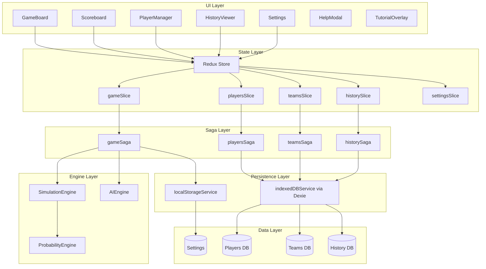
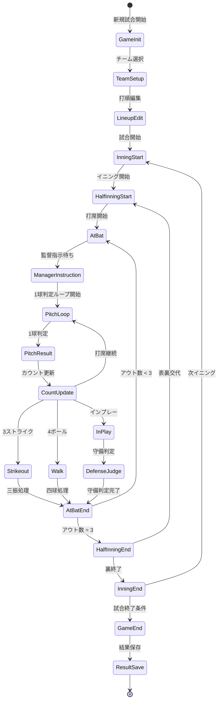
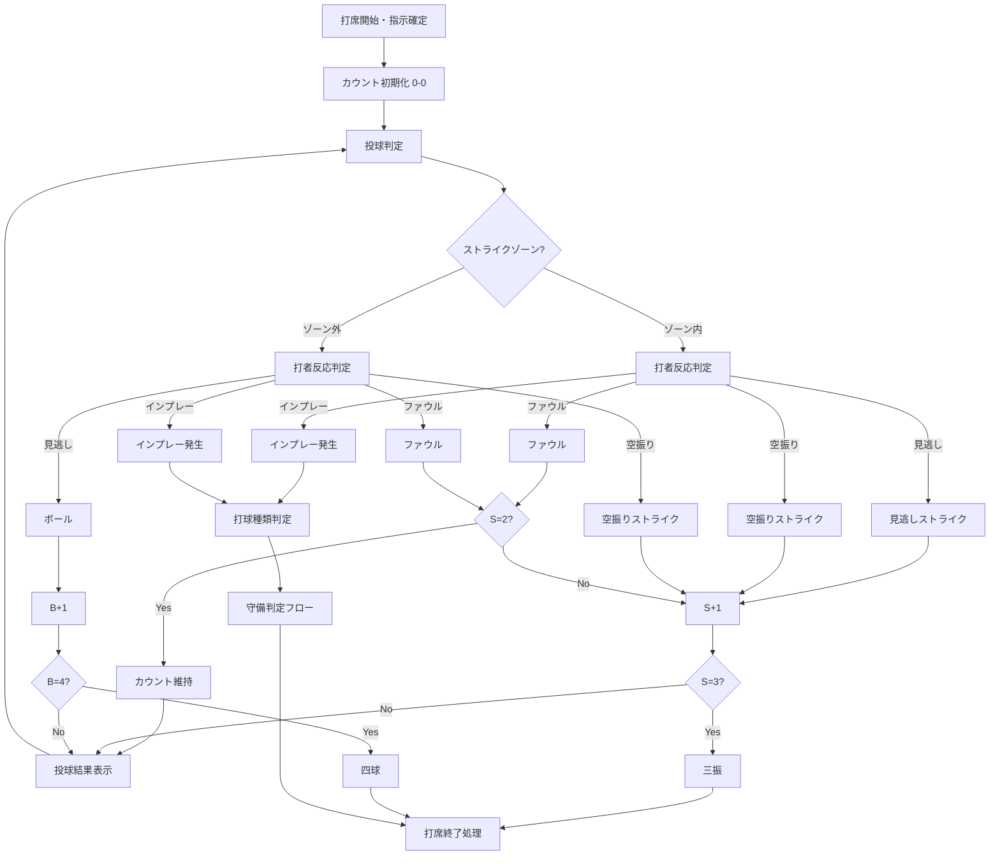
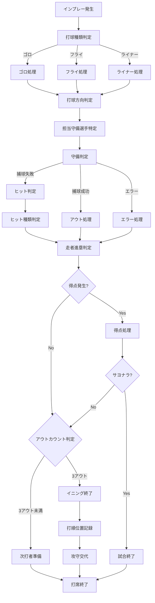
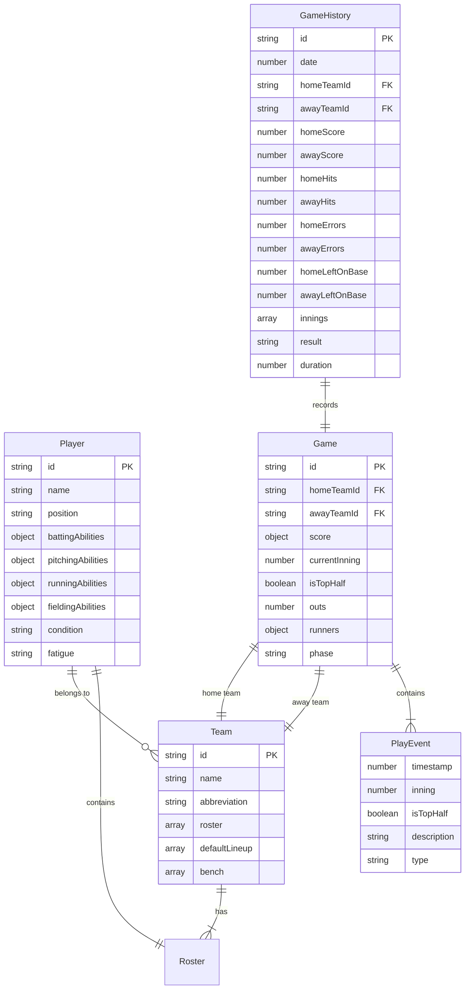

# テクニカルデザインドキュメント

## 概要

**目的**: 本機能は、OOTP26に触発された詳細な選手能力システムを持つ野球監督シミュレーションゲームをブラウザ上で提供する。

**ユーザー**: 野球ファンおよびシミュレーションゲーム愛好者が、プレイ毎に戦術的指示を出してチームを勝利に導くために利用する。

**影響**: ブラウザストレージ（localStorage/IndexedDB）を使用したオフライン対応のゲーム体験を新規に構築する。

### ゴール
- プレイヤーが監督として各打席で戦術指示（通常打撃、バント、盗塁、守備シフト等）を出せる
- **ゲーム進行の基本原則**: プレイヤーの指示入力を受けるまでゲームは進行しない（オートモード有効時を除く）
- OOTP26準拠の85種類の選手能力値によるリアルな野球シミュレーション
- CPU操作チームとの対戦機能（複数難易度のAI）
- 試合履歴・戦績の永続化と分析機能

### 非ゴール
- マルチプレイヤー対戦（将来拡張）
- クラウド同期・オンラインセーブ（将来拡張）
- 実在選手データの提供（ユーザー作成またはインポート）
- シーズンモード・リーグ管理（将来拡張）

## アーキテクチャ

> 詳細なリサーチノートは `research.md` を参照。

### アーキテクチャパターン＆境界マップ

**選択したパターン**: Feature-First + Redux Saga + 分離されたゲームエンジン



**アーキテクチャ統合**:
- 選択したパターン: Feature-First組織 + Redux Saga（ステアリングと整合）
- ドメイン/機能境界: Game、Players、Teams、History、Settingsの5機能ドメイン
- 既存パターン保持: Redux Toolkit + Saga（既存todosの構造を拡張）
- 新規コンポーネント根拠: ゲームエンジン層（SimulationEngine、ProbabilityEngine、AIEngine）は純粋関数として分離しテスト容易性を確保
- ステアリング準拠: モノレポ構成、TypeScript strict mode、ESLint/Prettier統合

### テクノロジースタック

| 層 | 選択/バージョン | 機能における役割 | 備考 |
|---|----------------|-----------------|------|
| フロントエンド | React 18.3 + Vite 5.4 | ゲームUI、インタラクション | 既存スタック継続 |
| 状態管理 | Redux Toolkit + Redux Saga | ゲーム状態、非同期ロジック | 既存スタック継続 |
| UIライブラリ | PrimeReact 10.8 | UIコンポーネント、フォーム | 既存スタック継続 |
| データ永続化 | Dexie.js 3.2+ | 選手・チーム・履歴のIndexedDB管理 | 新規追加 |
| 軽量ストレージ | localStorage API | 設定、現在のゲーム状態 | 標準API |
| 言語 | TypeScript 5.6+ (strict) | 型安全性 | 既存スタック継続 |

## システムフロー

### 試合進行フロー



**主要な状態遷移**:
- `GameInit` → `TeamSetup`: 対戦チーム選択（意思決定ポイント）
- `TeamSetup` → `LineupEdit`: 打順編集（意思決定ポイント）
- `AtBat` → `ManagerInstruction`: プレイヤーまたはCPUの指示待ち（意思決定ポイント）
- `ManagerInstruction`: タイムアウトなしで選択待ちを継続。指示は打席開始時に1回のみ

**ゲーム進行の基本原則（Req 2 AC 2.1-2.26）**:

*指示待機の必須化*:
- プレイヤーからの指示入力を受けるまでゲームは進行しない
- `awaiting_instruction`フェーズは無期限に維持され、プレイヤー入力を必須とする
- 離席してもタイムアウトせず、試合状態を保持

*意思決定ポイント*:
- 打席開始時の攻撃指示、守備指示、選手交代、打順編集、チーム選択
- 意思決定ポイント以外（1球判定、守備判定、進塁処理）は自動進行

*指示待機中の許可操作*:
- ヘルプ表示、選手詳細確認、設定変更、試合中断
- 操作完了後は指示選択画面に戻り待機継続

*オートモード例外*:
- `aiDelegationMode: 'auto'` / `autoModeScope: 'inning' | 'game'` 時のみAI委譲で自動進行
- 「オートモード中」インジケーター＋「手動操作に戻す」ボタンを常時表示
- Escキー/中断ボタンで即座に解除可能

*CPU vs プレイヤー*:
- プレイヤーチーム: 意思決定ポイントで指示待機
- CPUチーム: 0.5-1.5秒の思考時間後に自動進行

- `PitchLoop` → `PitchResult`: 1球毎の判定を実行（ストライク/ボール/ファウル/インプレー）- 指示待機なしで自動進行
- `CountUpdate`: カウント更新後、打席終了条件（3ストライク/4ボール/インプレー）をチェック
- 打者がアウトになった場合は打順を進め、3アウト成立時も次の半イニングの先頭打者に反映する
- 各チームの打順位置は独立管理し、イニング間で継続する
- `GameEnd`: 9回終了、サヨナラ、コールドゲーム等の条件判定
- `Any` → `Paused`: 中断メニュー（再開/保存して終了/保存せず終了）- 指示待機中も利用可能

### 1球判定ループフロー



### 打席判定フロー（守備判定）



### 勝敗・終了条件

- 9回裏終了時に得点差があれば勝敗確定
- 9回表終了時点で後攻がリードなら裏は実施せず終了
- 同点の場合は延長（`SettingsState.maxInnings` まで）
- 延長裏で勝ち越しが発生した時点でサヨナラ終了
- 5回以降の大差（例: 10点差）でコールド適用
- 最大回で同点の場合は引き分けとして記録
- 試合終了時に試合時間とサマリーを表示し、履歴へ保存
- 終了時サマリーに両チームの安打数/エラー数/残塁数を含める
- 終了後は「新規試合/履歴確認/終了」のアクションを提示
- 保存せず終了した場合はノーゲーム扱いとして記録しない

## 要件トレーサビリティ

| 要件 | サマリー | コンポーネント | インターフェース | フロー |
|-----|---------|--------------|----------------|-------|
| 1.1-1.18 | 試合開始とゲームフロー | GameSlice, GameSaga, GameBoard | GameState, GameActions | 試合進行フロー |
| 2.1-2.26 | ゲーム進行の基本原則（指示待機、意思決定ポイント、オートモード、投球表示、CPU動作） | GameSaga, InstructionPanel, SettingsSlice, AutoModeIndicator | GamePhase, aiDelegationMode, autoModeScope, DecisionPoint | 試合進行フロー |
| 2.1-2.23 | プレイ毎の監督指示 | InstructionPanel, GameSaga | ManagerInstruction, InstructionType | 打席フロー |
| 3.1-3.156 | プレイ結果判定とシミュレーション | SimulationEngine, ProbabilityEngine | PlayResult, BattingResult | 打席判定フロー |
| 4.1-4.85 | 選手とチーム情報管理 | PlayersSlice, PlayersSaga, PlayerEditor | Player, PlayerAbilities | - |
| 5.1-5.30 | 試合状況の可視化 | Scoreboard, RunnerDisplay, PlayLog | GameDisplay, PlayEvent | - |
| 6.1-6.25 | ゲームの勝敗判定 | GameSaga, SimulationEngine | GameResult, WinCondition | - |
| 7.1-7.30 | エラーハンドリングとユーザビリティ | ErrorBoundary, AutoSave | ErrorState, SaveState | - |
| 8.1-8.40 | 試合履歴と戦績管理 | HistorySlice, HistorySaga, HistoryViewer | GameHistory, Statistics | - |
| 9.1-9.72 | 選手とチームのデータ管理 | PlayerManager, TeamManager, ImportExport | PlayerData, TeamData | - |
| 10.1-10.106 | CPU操作チームの戦術AI | AIEngine, AIDelegation | AIDecision, TacticType | - |
| 11.1-11.57 | 守備シフトシステム | ShiftSelector, SimulationEngine | DefensiveShift, ShiftEffect | - |

## 要件トレーサビリティ詳細

### Requirement 1: 試合開始とゲームフロー
- **主要コンポーネント**: `GameBoard`, `GameSaga`, `GameSlice`
- **主要データ**: `GameState.phase`, `currentInning`, `isTopHalf`, `score`
- **フロー**: 試合進行フロー（チーム選択→打順編集→試合開始→イニング進行）
- **保存**: 試合途中は`noraneko:currentGame`に自動保存

### Requirement 2: プレイ毎の監督指示
- **主要コンポーネント**: `InstructionPanel`, `GameSaga`, `SettingsSlice`, `AutoModeIndicator`, `DecisionPointHandler`
- **主要データ**: `ManagerInstruction`, `InstructionType`, `aiDelegationMode`, `autoModeScope`, `DecisionPoint`
- **フロー**: 指示待ち→指示確定→プレイ実行→結果表示

#### ゲーム進行の基本原則（AC 2.1-2.26）

**指示待機の必須化（AC 2.1-2.4）**
- プレイヤーからの指示入力を受けるまでゲームは進行しない
- 指示選択画面は無期限に表示され、タイムアウトなし
- 離席時も試合状態を保持し続ける
- `awaiting_instruction`フェーズは明示的操作があるまで遷移しない

**意思決定ポイントの定義（AC 2.5-2.7）**
- 意思決定ポイント一覧: 
  - 打席開始時の攻撃指示
  - 打席開始前の守備指示
  - 選手交代の判断（代打/代走/守備固め）
  - 試合開始前の打順編集
  - チーム選択とホーム/ビジター選択
- 意思決定ポイント以外（1球判定ループ、守備判定、走者進塁処理）は自動進行

**指示待機中に許可される操作（AC 2.8-2.10）**
- ヘルプ/ルール説明の表示
- 選手詳細情報の確認
- 試合状況（スコアボード、プレイログ）の確認
- 設定画面へのアクセス
- 試合の一時中断（Pauseメニュー）
- 操作完了後は指示選択画面に戻り待機継続

**オートモード例外条件（AC 2.11-2.15）**
- `aiDelegationMode: 'auto'`時はAI委譲で自動進行
- 「オートモード中」インジケーター常時表示
- 「手動操作に戻す」ボタン常時表示
- 解除時は次の意思決定ポイントから通常動作に復帰

**オートモードの開始と終了（AC 2.16-2.19）**
- 開始方法: 設定画面での有効化、指示画面での「AI委譲」ボタン、イニング/試合単位の委譲
- 終了方法: 「手動操作に戻す」ボタン、Escキー/中断ボタン
- イニング委譲時はイニング終了後に確認ダイアログ表示
- 試合委譲時は重要場面のみハイライト表示オプション提供

**投球表示設定との関係（AC 2.20-2.23）**
- 詳細モード: 1球毎表示、打席開始時のみ指示待機
- 簡易モード: 最終結果のみ表示、打席開始時のみ指示待機
- 「クリックで続行」は結果確認であり指示選択ではない

**CPU vs プレイヤーチームの動作差異（AC 2.24-2.26）**
- プレイヤーチーム: 意思決定ポイントで指示待機（オートモード無効時）
- CPUチーム: AI判断で自動進行（0.5-1.5秒思考時間）
- CPUターンはプレイヤーが観戦、結果のみ確認

- **UI対応**: 攻撃/守備で指示メニュー切替、ツールチップで説明表示、オートモードインジケーター、意思決定ポイント明示

### Requirement 3: プレイ結果の判定とシミュレーション
- **主要コンポーネント**: `SimulationEngine`, `ProbabilityEngine`
- **主要データ**: `AtBatInput`, `AtBatResult`, `PitchResult`, `CountState`, `BallType/Direction/Strength`
- **フロー**: 1球判定ループフロー → 打席判定フロー（カウント管理→1球判定→三振/四球/インプレー→守備判定→進塁）
- **1球判定**: 各投球で見逃し/空振り/ボール/ファウル/インプレーを判定、カウント状況に応じた確率補正を適用
- **打席終了条件**: 3ストライク（三振）、4ボール（四球）、インプレー（打球発生）
- **ルール**: 疲労/コンディション補正、カウント別補正、守備シフト効果を適用

### Requirement 4: 選手とチーム情報の管理
- **主要コンポーネント**: `PlayersSlice`, `PlayersSaga`, `TeamManager`
- **主要データ**: `Player`, `TeamRecord`, `AbilityDefinitions`
- **UI対応**: 能力値表示、打順編集、推奨打順

### Requirement 5: 試合状況の可視化
- **主要コンポーネント**: `Scoreboard`, `RunnerDisplay`, `PlayLog`, `PitchDisplay`
- **主要データ**: `PlayEvent`, `RunnerState`, `InningScore`, `CountState`, `PitchResult`
- **UI対応**: 得点強調、重要局面ラベル、ログフィルタ/制限
- **投球表示**: 詳細モード（1球毎表示）/簡易モード（最終結果のみ）を設定で切替
- **カウント表示**: B-S形式でスコアボード上に常時表示、打者有利/投手有利で色分け（緑/赤/黄）

### Requirement 6: ゲームの勝敗判定
- **主要コンポーネント**: `GameSaga`, `SimulationEngine`
- **主要データ**: `WinCondition`, `GameHistoryRecord`
- **ルール**: 9回/延長/サヨナラ/コールド/引き分け

### Requirement 7: エラーハンドリングとユーザビリティ
- **主要コンポーネント**: `ErrorBoundary`, `LocalStorageService`, `SettingsSlice`
- **主要データ**: `ErrorState`, `SaveState`, `CrashInfo`
- **UI対応**: 入力エラーの説明/再提示、ヘルプ/チュートリアル表示

### Requirement 8: 試合履歴と戦績管理
- **主要コンポーネント**: `HistorySlice`, `HistorySaga`, `HistoryViewer`
- **主要データ**: `GameHistoryRecord`, `Statistics`
- **UI対応**: フィルタ/ページング/色分け/グラフ表示

### Requirement 9: 選手とチームのデータ管理
- **主要コンポーネント**: `PlayerManager`, `TeamManager`, `ImportExportService`
- **主要データ**: `PlayerRecord`, `TeamRecord`, `ImportResult`
- **ルール**: ロースター最小人数/能力値バリデーション/バックアップ

### Requirement 10: CPU操作チームの戦術AI
- **主要コンポーネント**: `AIEngine`, `GameSaga`
- **主要データ**: `AIOffensiveInput`, `AIDefensiveInput`, `AIDecision`
- **UI対応**: AI委譲/推奨表示、難易度/積極性設定

### Requirement 11: 守備シフトシステム
- **主要コンポーネント**: `ShiftSelector`, `SimulationEngine`
- **主要データ**: `DefensiveShift`, `shiftLockRemaining`, `ShiftStat`
- **UI対応**: シフト効果説明/警告/統計表示

## コンポーネントとインターフェース

### コンポーネントサマリー

| コンポーネント | ドメイン/層 | 目的 | 要件カバレッジ | 主要依存 | コントラクト |
|-------------|-----------|------|--------------|---------|------------|
| GameSlice | State | 試合状態管理 | 1, 2, 5, 6 | - | State |
| GameSaga | Saga | 試合ロジック実行 | 1, 2, 3, 6 | SimulationEngine (P0), AIEngine (P0) | Service |
| SimulationEngine | Engine | 野球プレイシミュレーション | 3 | ProbabilityEngine (P0) | Service |
| ProbabilityEngine | Engine | 確率計算 | 3 | - | Service |
| AIEngine | Engine | CPU戦術判断 | 10 | ProbabilityEngine (P1) | Service |
| PlayersSlice | State | 選手データ状態 | 4, 9 | - | State |
| PlayersSaga | Saga | 選手CRUD操作 | 4, 9 | IndexedDBService (P0) | Service |
| TeamsSlice | State | チームデータ状態 | 4, 9 | - | State |
| HistorySlice | State | 履歴データ状態 | 8 | - | State |
| HistorySaga | Saga | 履歴永続化 | 8 | IndexedDBService (P0) | Service |
| SettingsSlice | State | 設定状態 | 7 | - | State |
| IndexedDBService | Persistence | Dexie.jsラッパー | 4, 8, 9 | Dexie.js (P0) | Service |
| LocalStorageService | Persistence | localStorage操作 | 7 | - | Service |
| GameBoard | UI | メインゲーム画面 | 1, 2, 5 | GameSlice (P0) | - |
| Scoreboard | UI | スコアボード表示 | 5 | GameSlice (P0) | - |
| InstructionPanel | UI | 監督指示選択 | 2 | GameSlice (P0) | - |
| PlayerManager | UI | 選手管理画面 | 4, 9 | PlayersSlice (P0) | - |
| TeamManager | UI | チーム管理画面 | 9 | TeamsSlice (P0) | - |
| HistoryViewer | UI | 試合履歴・戦績表示/フィルタ | 8 | HistorySlice (P0) | - |
| Settings | UI | 設定画面 | 7, 10, 11 | SettingsSlice (P0) | - |
| HelpModal | UI | ルール/操作ヘルプ表示 | 7 | SettingsSlice (P1) | - |
| TutorialOverlay | UI | 初回チュートリアル | 7 | SettingsSlice (P1) | - |

### UI/UX要件対応

- スコアボードは得点、イニング、アウト/ボール/ストライク、打順位置を常時表示
- イニング別得点の表をHTMLで表示し、得点時は視覚的に強調
- 塁状況はベース表示と選手名表示オプションで可視化し、進塁はアニメーションで強調
- 実況テキストはプレイ結果・重要プレイをCSSクラスで強調し、ログに時刻/打者/結果を保存
- ガイドメッセージで次に必要な操作（指示選択/確認/再開など）を常時表示
- 指示オプションはボタンUIで提供し、ツールチップに簡潔な説明を表示
- 得点圏/接戦/サヨナラ機会などの重要局面はラベル表示で強調する
- 履歴/戦績画面はフィルタ・ページング・色分けで視認性を確保
- 投手疲労が閾値を超えた場合は警告と交代推奨を表示する
- 戦績サマリーは勝率を小数点第3位まで表示し、連勝/連敗や自己ベストを含める
- 戦績推移はCanvas/SVGまたはチャートで表示する
- 能力値は色分けバー表示とOVR自動計算で可視化する
- UIはレスポンシブ対応とテーマ切替（ライト/ダーク/システム）を提供する
- 履歴削除は範囲選択と確認ダイアログを伴い、詳細ログは圧縮オプションを提供する
- ヘルプには能力値ガイドとサンプルJSONへのリンクを含める
- ログはイニング単位のフィルタと最大件数制限を提供する
- 打順編集はドラッグ&ドロップまたは番号入力で変更できる
- 推奨打順は選球眼・長打力を重み付けして自動生成する
- AI委譲中はハイライト表示を選択でき、Esc/中断で手動操作に戻れる
- AI委譲統計（使用回数/得点率/勝率）はPlayLogの`source`集計で算出する
- 守備シフトの使用回数/成功率/被長打率を試合後と戦績画面で表示する

**ゲーム進行の基本原則対応（AC 2.1-2.26）**:
- **指示待機動作**: 意思決定ポイントで指示選択画面を表示し、プレイヤー入力があるまで無期限に待機（タイムアウトなし、離席対応）
- **意思決定ポイント明示**: 現在の意思決定ポイント種別（攻撃指示/守備指示/選手交代等）をヘッダーに表示
- **指示待機中の補助操作**: ヘルプ、選手詳細、設定、中断ボタンを指示選択画面に配置。操作後は指示選択に戻る
- **オートモードインジケーター**: オートモード有効時は画面上部に「オートモード中」を常時表示
- **手動操作復帰ボタン**: オートモード中は「手動操作に戻す」ボタンを常時表示
- **オートモード開始UI**: 指示選択画面に「AI委譲」「このイニングをAIに委譲」「試合全体をAIに委譲」オプションを配置
- **イニング委譲確認**: イニング委譲終了後に「手動操作に戻りますか？」ダイアログ表示
- **ハイライトモード**: 試合委譲時は重要場面（得点、選手交代等）のみハイライト表示するオプション
- **Esc/中断による解除**: オートモード中はEscキーまたは中断ボタンで即座に解除可能
- **投球表示と指示待機の分離**: 詳細モード/簡易モードに関わらず、指示待機は打席開始時のみ。「クリックで続行」は結果確認であり指示選択ではないことを明示
- **CPU操作チーム表示**: CPUターンでは「（CPU監督）○○の指示！」と表示し、0.5-1.5秒後に自動実行

### State Layer

#### GameSlice

| フィールド | 詳細 |
|-----------|------|
| 目的 | 試合中のゲーム状態を管理する |
| 要件 | 1.1-1.18, 2.1-2.23, 5.1-5.30, 6.1-6.25 |

**責務と制約**
- 試合状態（スコア、イニング、アウト、ランナー）の保持
- ゲームフェーズの遷移管理
- 現在打席の状態管理
- **ゲーム進行の基本原則（AC 2.1-2.26）**:
  - `awaiting_instruction`フェーズではプレイヤーの指示入力があるまで無期限に待機
  - 意思決定ポイント（打席開始、守備指示、選手交代、打順編集、チーム選択）でのみ待機
  - 意思決定ポイント以外（1球判定、守備判定、進塁処理）は自動進行
  - オートモード有効時（`isAutoModeActive: true`）のみAI委譲で自動進行
  - 指示待機中もヘルプ表示、設定変更、試合中断を許可
- プレイログは`SettingsState.playLogMaxEntries`で制限し、超過分は`playLogArchive`へ圧縮
- イニング終了時の自動保存と中断/再開状態の保持
- **試合時間計測ポリシー**:
  - `elapsedSeconds` は「実プレイ時間」を表す
  - 指示待機中（`awaiting_instruction`）も計測を継続する（AC 2.10）
  - `paused` 中は計測を停止し、再開で続きから計測する

**依存**
- Inbound: GameBoard, Scoreboard, InstructionPanel — UI表示 (P0)
- Outbound: GameSaga — プレイ実行 (P0)

**コントラクト**: State [ ✓ ]

##### 状態管理

```typescript
interface GameState {
  // ゲームフェーズ
  phase: GamePhase;
  
  // 試合基本情報
  gameId: string;
  homeTeam: TeamInGame;
  awayTeam: TeamInGame;
  
  // スコアボード
  score: {
    home: number;
    away: number;
    innings: InningScore[];
  };
  
  // 現在の状況
  currentInning: number;
  isTopHalf: boolean;
  outs: number;
  runners: RunnerState;
  
  // 打席状態
  currentAtBat: AtBatState | null;
  
  // 投手状態
  currentPitcher: PitcherInGame;
  
  // プレイログ
  playLog: PlayEvent[];
  playLogArchive: PlayEvent[];
  
  // 設定
  maxInnings: number;
  isPlayerHome: boolean;

  // 守備シフト
  defensiveShift: DefensiveShift;
  shiftLockRemaining: number;

  // 試合時間
  gameStartTime: number;
  elapsedSeconds: number;

  // オートモード状態（AC 2.11-2.19）
  isAutoModeActive: boolean;           // オートモード有効時はtrue
  autoModeScope: AutoModeScope | null; // オートモードの範囲
  autoModeInningEnd: number | null;    // イニング委譲時の終了イニング
  showHighlightsOnly: boolean;         // 試合委譲時のハイライト表示モード
}

// オートモードの範囲（AC 2.16-2.18）
type AutoModeScope = 
  | 'at_bat'     // 打席単位（「AI委譲」ボタン押下時）
  | 'inning'     // イニング単位（「このイニングをAIに委譲」）
  | 'game'       // 試合単位（「試合全体をAIに委譲」）
  | 'always';    // 常時（設定での「常にAI委譲」）

// 意思決定ポイント種別（AC 2.5）
type DecisionPointType = 
  | 'offensive_instruction'   // 打席開始時の攻撃指示
  | 'defensive_instruction'   // 打席開始前の守備指示
  | 'substitution'            // 選手交代（代打/代走/守備固め）
  | 'lineup_edit'             // 試合開始前の打順編集
  | 'team_selection';         // チーム選択とホーム/ビジター選択

type GamePhase =
  | 'idle'
  | 'team_setup'
  | 'lineup_edit'
  | 'inning_start'
  | 'at_bat'
  | 'awaiting_instruction'
  | 'play_execution'
  | 'result_display'
  | 'half_inning_end'
  | 'inning_end'
  | 'game_end'
  | 'paused';

interface RunnerState {
  first: Runner | null;
  second: Runner | null;
  third: Runner | null;
}

interface Runner {
  playerId: string;
  playerName: string;
}

interface AtBatState {
  batterId: string;
  batterName: string;
  batterIndex: number;
  pitcherId: string;
  pitcherName: string;
  
  // カウント状態
  balls: number;       // 0-3
  strikes: number;     // 0-2
  
  // 1球判定システム関連
  instruction: InstructionType;        // 確定した監督指示
  pitchHistory: PitchResult[];         // 投球履歴
  atBatPhase: AtBatPhase;              // 打席フェーズ
  
  // カウント状況フラグ
  isCountAdvantage: 'batter' | 'pitcher' | 'neutral' | 'full';
}

// 1球判定結果
interface PitchResult {
  pitchNumber: number;                 // 第何球目
  result: PitchOutcome;                // 結果
  countBefore: { balls: number; strikes: number };  // 投球前カウント
  countAfter: { balls: number; strikes: number };   // 投球後カウント
  isStrikeZone: boolean;               // ストライクゾーン内か
  batterAction: 'take' | 'swing' | 'bunt';  // 打者の動作
}

type PitchOutcome = 
  | 'called_strike'      // 見逃しストライク
  | 'swinging_strike'    // 空振りストライク
  | 'ball'               // ボール
  | 'foul'               // ファウル
  | 'in_play';           // インプレー

type AtBatPhase = 
  | 'awaiting_instruction'  // 監督指示待ち
  | 'pitch_loop'            // 1球判定ループ中
  | 'in_play_processing'    // インプレー処理中
  | 'completed';            // 打席完了

interface PlayEvent {
  timestamp: number;
  inning: number;
  isTopHalf: boolean;
  description: string;
  type: PlayEventType;
  source: 'player' | 'cpu' | 'ai_delegate';
  scoreChange?: { home: number; away: number };
}
```

- 状態モデル: Redux ToolkitのcreateSliceで定義
- 永続化: localStorageで試合途中状態を保存
- 並行性: 単一Reduxストアで一貫性保証

#### PlayersSlice

| フィールド | 詳細 |
|-----------|------|
| 目的 | 選手データベースの状態を管理する |
| 要件 | 4.1-4.85, 9.1-9.72 |

**コントラクト**: State [ ✓ ]

##### 状態管理

```typescript
interface PlayersState {
  players: Record<string, Player>;
  loading: boolean;
  error: string | null;
  selectedPlayerId: string | null;
  filters: PlayerFilters;
}

interface Player {
  id: string;
  name: string;
  teamId: string | null;
  position: Position;
  batterHand: 'left' | 'right' | 'switch';
  pitcherHand?: 'left' | 'right';
  
  // 85能力値（OOTP26準拠）: 参照・編集・表示の一次情報
  abilities: Record<AbilityId, number>;

  // 打撃能力 (1-100)
  batting: BattingAbilities;
  
  // 投手能力 (1-100) - 投手のみ
  pitching?: PitchingAbilities;
  
  // 走塁能力 (1-100)
  running: RunningAbilities;
  
  // 守備能力 (1-100)
  fielding: FieldingAbilities;
  
  // 状態
  condition: Condition;
  fatigue: FatigueLevel;
}

interface BattingAbilities {
  contact: number;           // コンタクト能力
  babip: number;             // BABIP能力
  gapPower: number;          // ギャップ長打力
  hrPower: number;           // 本塁打力
  eye: number;               // 選球眼
  avoidKs: number;           // 三振回避能力
  vsLHP: number;             // 対左投手
  vsRHP: number;             // 対右投手
}

interface PitchingAbilities {
  stuff: number;             // 球威
  movement: number;          // 変化球
  control: number;           // 制球力
  stamina: number;           // スタミナ
  groundBallPct: number;     // ゴロ率
  velocity: number;          // 球速
  holdRunners: number;       // 牽制能力
}

interface RunningAbilities {
  speed: number;             // 走力
  stealingAbility: number;   // 盗塁能力
  stealingAggr: number;      // 盗塁積極性
  baserunning: number;       // 走塁技術
}

interface FieldingAbilities {
  infieldRange: number;      // 内野守備範囲
  outfieldRange: number;     // 外野守備範囲
  infieldError: number;      // 内野エラー率（高いほど確実）
  outfieldError: number;     // 外野エラー率
  infieldArm: number;        // 内野肩力
  outfieldArm: number;       // 外野肩力
  turnDP: number;            // 併殺処理能力
  catcherAbility?: number;   // 捕手総合能力
  catcherArm?: number;       // 捕手肩力
  sacrificeBunt: number;     // 犠打バント能力
  buntForHit: number;        // セーフティバント能力
  positionRatings: PositionRatings;
}

interface PositionRatings {
  P?: 'A' | 'B' | 'C' | 'D' | 'F';
  C?: 'A' | 'B' | 'C' | 'D' | 'F';
  '1B'?: 'A' | 'B' | 'C' | 'D' | 'F';
  '2B'?: 'A' | 'B' | 'C' | 'D' | 'F';
  '3B'?: 'A' | 'B' | 'C' | 'D' | 'F';
  SS?: 'A' | 'B' | 'C' | 'D' | 'F';
  LF?: 'A' | 'B' | 'C' | 'D' | 'F';
  CF?: 'A' | 'B' | 'C' | 'D' | 'F';
  RF?: 'A' | 'B' | 'C' | 'D' | 'F';
}

type Position = 'P' | 'C' | '1B' | '2B' | '3B' | 'SS' | 'LF' | 'CF' | 'RF' | 'DH';
type Condition = 'excellent' | 'good' | 'normal' | 'poor' | 'terrible';
type FatigueLevel = 'fresh' | 'normal' | 'tired' | 'exhausted';

type AbilityCategory = 'batting' | 'pitching' | 'running' | 'fielding' | 'catching' | 'other';
type AbilityId = string;

interface AbilityDefinition {
  id: AbilityId;
  label: string;
  category: AbilityCategory;
  min: 1;
  max: 100;
}

// AbilityDefinitionはOOTP26準拠で85件を維持する（詳細定義は能力カタログに集約）
type AbilityDefinitions = AbilityDefinition[];
```

**実装ノート**
- `abilities` を単一の真実（SoT）とし、`batting/pitching/running/fielding` はゲーム用に正規化した派生ビューとして生成・同期する
- 能力カタログは85件を固定で保持し、選手詳細画面はカタログ順に全能力を表示する
- 初回起動時は `data/default_players.json` から30人以上の選手データをfetchでロードし、能力値1-100のバリデーションを実施する
- バリデーション失敗は選手単位でスキップし、成功数と失敗詳細をUIに通知する

##### 能力カタログ（85項目）

> すべて1-100スケールの数値能力。列挙値（利き腕・コンディション・疲労度等）は別途属性として保持する。

| # | id | label | category |
|---|----|-------|----------|
| 1 | batting_contact | Contact | batting |
| 2 | batting_babip | BABIP | batting |
| 3 | batting_gap_power | Gap Power | batting |
| 4 | batting_hr_power | Home Run Power | batting |
| 5 | batting_eye | Eye / Discipline | batting |
| 6 | batting_avoid_ks | Avoid K's | batting |
| 7 | batting_vs_lhp | vs LHP | batting |
| 8 | batting_vs_rhp | vs RHP | batting |
| 9 | batting_clutch | Clutch | batting |
| 10 | batting_pitch_recognition | Pitch Recognition | batting |
| 11 | batting_line_drive | Line Drive Tendency | batting |
| 12 | batting_ground_ball | Ground Ball Tendency | batting |
| 13 | batting_fly_ball | Fly Ball Tendency | batting |
| 14 | batting_pull | Pull Tendency | batting |
| 15 | batting_center | Center Tendency | batting |
| 16 | batting_opposite | Opposite Field Tendency | batting |
| 17 | batting_sacrifice_bunt | Sacrifice Bunt | batting |
| 18 | batting_bunt_for_hit | Bunt for Hit | batting |
| 19 | batting_avoid_gidp | Avoid GIDP | batting |
| 20 | batting_plate_discipline | Plate Discipline | batting |
| 21 | pitching_stuff | Stuff | pitching |
| 22 | pitching_movement | Movement | pitching |
| 23 | pitching_control | Control | pitching |
| 24 | pitching_stamina | Stamina | pitching |
| 25 | pitching_ground_ball_pct | Ground Ball % | pitching |
| 26 | pitching_velocity | Velocity | pitching |
| 27 | pitching_hold_runners | Hold Runners | pitching |
| 28 | pitching_consistency | Consistency | pitching |
| 29 | pitching_stuff_vs_lhb | Stuff vs LHB | pitching |
| 30 | pitching_stuff_vs_rhb | Stuff vs RHB | pitching |
| 31 | pitching_control_vs_lhb | Control vs LHB | pitching |
| 32 | pitching_control_vs_rhb | Control vs RHB | pitching |
| 33 | pitching_pitch_1 | Pitch 1 | pitching |
| 34 | pitching_pitch_2 | Pitch 2 | pitching |
| 35 | pitching_pitch_3 | Pitch 3 | pitching |
| 36 | pitching_pitch_4 | Pitch 4 | pitching |
| 37 | pitching_pitch_5 | Pitch 5 | pitching |
| 38 | pitching_composure | Composure | pitching |
| 39 | running_speed | Speed | running |
| 40 | running_stealing_ability | Stealing Ability | running |
| 41 | running_stealing_aggr | Stealing Aggressiveness | running |
| 42 | running_baserunning | Baserunning | running |
| 43 | running_first_step | First Step | running |
| 44 | running_lead_off | Lead Off | running |
| 45 | running_hustle | Hustle | running |
| 46 | running_endurance | Endurance | running |
| 47 | fielding_infield_range | Infield Range | fielding |
| 48 | fielding_outfield_range | Outfield Range | fielding |
| 49 | fielding_infield_error | Infield Error | fielding |
| 50 | fielding_outfield_error | Outfield Error | fielding |
| 51 | fielding_infield_arm | Infield Arm | fielding |
| 52 | fielding_outfield_arm | Outfield Arm | fielding |
| 53 | fielding_turn_dp | Turn Double Play | fielding |
| 54 | fielding_reaction | Reaction | fielding |
| 55 | fielding_footwork | Footwork | fielding |
| 56 | fielding_throw_accuracy | Throw Accuracy | fielding |
| 57 | fielding_throw_strength | Throw Strength | fielding |
| 58 | fielding_glove | Glove | fielding |
| 59 | fielding_1b_defense | 1B Defense | fielding |
| 60 | fielding_2b_defense | 2B Defense | fielding |
| 61 | fielding_3b_defense | 3B Defense | fielding |
| 62 | fielding_ss_defense | SS Defense | fielding |
| 63 | fielding_lf_defense | LF Defense | fielding |
| 64 | fielding_cf_defense | CF Defense | fielding |
| 65 | fielding_rf_defense | RF Defense | fielding |
| 66 | fielding_p_defense | P Defense | fielding |
| 67 | fielding_c_defense | C Defense | fielding |
| 68 | fielding_dh_defense | DH Defense | fielding |
| 69 | catching_ability | Catcher Ability | catching |
| 70 | catching_arm | Catcher Arm | catching |
| 71 | catching_framing | Framing | catching |
| 72 | catching_blocking | Blocking | catching |
| 73 | catching_game_calling | Game Calling | catching |
| 74 | other_durability | Durability | other |
| 75 | other_leadership | Leadership | other |
| 76 | other_work_ethic | Work Ethic | other |
| 77 | other_intelligence | Intelligence | other |
| 78 | other_adaptability | Adaptability | other |
| 79 | other_focus | Focus | other |
| 80 | other_injury_proneness | Injury Proneness | other |
| 81 | other_conditioning | Conditioning | other |
| 82 | other_potential_overall | Potential (Overall) | other |
| 83 | other_potential_batting | Potential (Batting) | other |
| 84 | other_potential_pitching | Potential (Pitching) | other |
| 85 | other_potential_fielding | Potential (Fielding) | other |

#### SettingsSlice

| フィールド | 詳細 |
|-----------|------|
| 目的 | 表示・操作・難易度などユーザー設定を管理 |
| 要件 | 2.1-2.26（ゲーム進行の基本原則）, 7.16-7.30, 10.73-10.103, 11.15, 6.8 |

**コントラクト**: State [ ✓ ]

##### 状態管理

```typescript
interface SettingsState {
  // 表示と言語
  language: 'ja' | 'en';
  theme: 'light' | 'dark' | 'system';
  reducedMotion: boolean;

  // ゲームテンポ
  textSpeed: 'instant' | 'progressive';
  textSpeedMs: number;
  clickToContinue: boolean;

  // 投球表示設定（1球単位判定システム対応）
  pitchDisplayMode: 'detailed' | 'simple';  // 詳細モード/簡易モード
  pitchDisplaySpeed: 'instant' | 'normal' | 'slow';  // 表示速度
  pitchDisplayDelayMs: number;  // 各投球間の待機時間（ms）: instant=0, normal=500, slow=1500
  showCountHighlight: boolean;  // カウント状況に応じた色分け表示
  showPitchByPitchLog: boolean;  // 1球毎のログを詳細表示

  // 難易度とAI委譲（AC 2.11-2.19, AC 2.16-2.18）
  cpuDifficulty: 'easy' | 'normal' | 'hard';
  
  // aiDelegationMode（ゲーム進行の基本原則との関係）:
  //   'off' - プレイヤー指示必須（AC 2.1-2.4: 全意思決定ポイントで待機）
  //   'confirm' - AI推奨を表示し、プレイヤーが確認後に実行（AC 2.8: 指示待機中の補助操作）
  //   'auto' - オートモード: AI委譲で自動進行（AC 2.11-2.15: 基本原則の例外条件）
  aiDelegationMode: 'off' | 'confirm' | 'auto';
  
  // defaultAutoModeScope（AC 2.16: オートモード開始方法）:
  //   'at_bat' - 打席単位で委譲
  //   'inning' - イニング単位で委譲（AC 2.17: イニング終了後に確認ダイアログ）
  //   'game' - 試合単位で委譲（AC 2.18: 重要場面のみハイライト表示オプション）
  defaultAutoModeScope: 'at_bat' | 'inning' | 'game';
  
  aiDelegationAggression: 'conservative' | 'normal' | 'aggressive';
  showAiRecommendations: boolean;
  
  // highlightOnlyMode（AC 2.18: 試合委譲時のハイライト表示）
  highlightOnlyMode: boolean;
  
  randomnessLevel: 'low' | 'normal' | 'high';

  // ルールと進行
  maxInnings: number; // 既定: 12
  autoSaveEnabled: boolean;
  playLogMaxEntries: number;
  playLogCompressionThreshold: number;
}
```

**保存**
- `noraneko:settings` に永続化
- 変更時は即時反映、次回起動時に復元

### Engine Layer

#### SimulationEngine

| フィールド | 詳細 |
|-----------|------|
| 目的 | 野球プレイのシミュレーションを実行する |
| 要件 | 3.1-3.156 |

**責務と制約**
- プレイ結果の確率的判定
- 純粋関数として実装（副作用なし）
- 決定論的シミュレーション（シード値サポート）
- 守備指示はGameSagaが適用し、必要に応じて即時結果（例: 敬遠=四球）を返す
- 守備シフトは打球方向確率には影響せず、守備判定にのみ適用する

**依存**
- Inbound: GameSaga — プレイ実行要求 (P0)
- Outbound: ProbabilityEngine — 確率計算 (P0)

**コントラクト**: Service [ ✓ ]

##### サービスインターフェース

```typescript
interface SimulationEngine {
  // ========== 1球判定システム ==========
  
  // 1球判定を実行（1球の結果を返す）
  simulateSinglePitch(input: PitchInput): PitchResult;
  
  // 打席全体をシミュレーション（1球判定ループを実行）
  simulateAtBatWithPitchLoop(input: AtBatInput): AtBatWithPitchResult;
  
  // ========== 打席シミュレーション ==========
  
  // 打席シミュレーション（インプレー後の守備判定）
  simulateAtBat(input: AtBatInput): AtBatResult;
  
  // 盗塁シミュレーション
  simulateSteal(input: StealInput): StealResult;
  
  // バントシミュレーション
  simulateBunt(input: BuntInput): BuntResult;
  
  // スクイズシミュレーション
  simulateSqueeze(input: SqueezeInput): SqueezeResult;
  
  // エンドランシミュレーション
  simulateHitAndRun(input: HitAndRunInput): HitAndRunResult;
  
  // 走者進塁判定
  calculateRunnerAdvancement(input: AdvancementInput): AdvancementResult;
}

// 1球判定入力
interface PitchInput {
  batter: Player;
  pitcher: Player;
  pitcherPitchCount: number;
  currentCount: CountState;
  instruction: InstructionType;
  runners: RunnerState;
}

// 打席結果（1球判定ループ込み）
interface AtBatWithPitchResult {
  pitchHistory: PitchResult[];      // 全投球履歴
  finalCount: CountState;           // 最終カウント
  outcome: AtBatPitchOutcome;       // 1球判定ループの中間結果
  atBatResult?: AtBatResult;        // インプレー時のみ守備判定結果
}

// 1球判定ループの中間結果
type AtBatPitchOutcome = 'strikeout' | 'walk' | 'in_play';

interface AtBatInput {
  batter: Player;
  pitcher: Player;
  pitcherPitchCount: number;
  runners: RunnerState;
  outs: number;
  instruction: ManagerInstruction;
  defensiveShift: DefensiveShift;
  fieldingTeam: FieldingTeam;
  randomSeed?: number;
}

interface AtBatResult {
  outcome: AtBatResolvedOutcome;
  ballType?: BallType;
  ballDirection?: BallDirection;
  ballStrength?: BallStrength;
  fielder?: Position;
  hitType?: HitType;
  errors?: FieldingError[];
  runnerResults: RunnerResult[];
  description: string;
}

// インプレー後の最終結果
type AtBatResolvedOutcome = 
  | 'strikeout'
  | 'walk'
  | 'hit_by_pitch'
  | 'single'
  | 'double'
  | 'triple'
  | 'home_run'
  | 'ground_out'
  | 'fly_out'
  | 'line_out'
  | 'double_play'
  | 'fielders_choice'
  | 'error';

type BallType = 'ground_ball' | 'fly_ball' | 'line_drive';
type BallDirection = 
  | 'third_line' | 'third_short' | 'short_center' | 'short_second'
  | 'second_first' | 'first_line'
  | 'left_field' | 'center_field' | 'right_field';
type BallStrength = 'weak' | 'medium' | 'strong';
type HitType = 'single' | 'double' | 'triple' | 'home_run' | 'infield_hit';

interface ManagerInstruction {
  type: InstructionType;
  targetRunners?: string[];
  // 守備指示用の追加情報
  shift?: DefensiveShift;
  nextPitcherId?: string;
}

type OffensiveInstructionType =
  | 'normal_swing'
  | 'sacrifice_bunt'
  | 'safety_bunt'
  | 'steal'
  | 'double_steal'
  | 'hit_and_run'
  | 'squeeze'
  | 'take';

type DefensiveInstructionType =
  | 'intentional_walk'
  | 'defensive_shift'
  | 'pitcher_change';

type InstructionType = OffensiveInstructionType | DefensiveInstructionType;

type DefensiveShift =
  | 'normal'
  | 'pull_right'
  | 'pull_left'
  | 'extreme_shift'
  | 'infield_in'
  | 'infield_back';
```

- InstructionPanelは攻守に応じてメニューを切替え、守備時は`pitcher_change`/`defensive_shift`/`intentional_walk`を提示する
- `defensiveShift`は3打席固定（`shiftLockRemaining`で管理）。設定で変更可能。
- 得点圏で極端シフト選択時はリスク警告を表示し、選択自体は許可する。

- 事前条件: 有効なプレイヤーデータと試合状態
- 事後条件: 確定的な結果オブジェクトを返却
- 不変条件: 入力状態を変更しない

#### ProbabilityEngine

| フィールド | 詳細 |
|-----------|------|
| 目的 | 選手能力値に基づく確率計算を行う |
| 要件 | 3.1-3.156 |

**コントラクト**: Service [ ✓ ]

##### サービスインターフェース

```typescript
interface ProbabilityEngine {
  // ========== 1球判定システム ==========
  
  // ストライクゾーン判定
  calculateStrikeZoneProbability(pitcher: PitchingAbilities, count: CountState): number;
  
  // 1球判定（ストライクゾーン内）
  calculatePitchResultInZone(
    pitcher: PitchingAbilities, 
    batter: BattingAbilities, 
    count: CountState,
    instruction: InstructionType
  ): PitchOutcomeProbabilities;
  
  // 1球判定（ストライクゾーン外）
  calculatePitchResultOutZone(
    pitcher: PitchingAbilities, 
    batter: BattingAbilities, 
    count: CountState,
    instruction: InstructionType
  ): PitchOutcomeProbabilities;
  
  // カウント状況補正を適用
  applyCountModifier(
    baseProbabilities: PitchOutcomeProbabilities, 
    count: CountState
  ): PitchOutcomeProbabilities;
  
  // カウント有利度判定
  determineCountAdvantage(count: CountState): 'batter' | 'pitcher' | 'neutral' | 'full';
  
  // ========== 打席結果判定（1球判定後） ==========
  
  // 打球種類確率計算
  calculateBallTypeProbabilities(pitcher: PitchingAbilities, batter: BattingAbilities): BallTypeProbabilities;
  
  // 打球方向確率計算
  calculateDirectionProbabilities(batterHand: 'left' | 'right', ballType: BallType): DirectionProbabilities;
  
  // 守備成功確率計算
  calculateFieldingSuccess(fielder: FieldingAbilities, ballType: BallType, ballStrength: BallStrength): number;
  
  // ========== 走塁・盗塁判定 ==========
  
  // 盗塁成功確率計算
  calculateStealSuccess(runner: RunningAbilities, pitcher: PitchingAbilities, catcher: FieldingAbilities): number;
  
  // 進塁成功確率計算
  calculateAdvancementSuccess(runner: RunningAbilities, fielder: FieldingAbilities, distance: 'short' | 'long'): number;
  
  // ========== 補正適用 ==========
  
  // 投手疲労補正
  applyPitcherFatigue(abilities: PitchingAbilities, pitchCount: number): PitchingAbilities;
  
  // コンディション補正
  applyConditionModifier(abilities: BattingAbilities, condition: Condition): BattingAbilities;
}

// 1球判定用の確率分布
interface PitchOutcomeProbabilities {
  calledStrike: number;     // 見逃しストライク確率
  swingingStrike: number;   // 空振りストライク確率
  ball: number;             // ボール確率
  foul: number;             // ファウル確率
  inPlay: number;           // インプレー確率
}

// カウント状態
interface CountState {
  balls: number;
  strikes: number;
}

interface BallTypeProbabilities {
  groundBall: number;
  flyBall: number;
  lineDrive: number;
}

interface DirectionProbabilities {
  thirdLine: number;
  thirdShort: number;
  shortCenter: number;
  shortSecond: number;
  secondFirst: number;
  firstLine: number;
  leftField: number;
  centerField: number;
  rightField: number;
}
```

**実装ノート**
- 全確率計算は要件定義の補正式に準拠
- 疲労補正: AC 34の累積減衰計算を実装
- コンディション補正: 絶好調+10-15%、不調-10-15%
- 乱数の振れ幅は`SettingsState.randomnessLevel`に応じて補正する

#### AIEngine

| フィールド | 詳細 |
|-----------|------|
| 目的 | CPU操作チームの戦術判断およびプレイヤーのAI委譲を行う |
| 要件 | 2.11-2.26（オートモード）, 10.1-10.106 |

**コントラクト**: Service [ ✓ ]

##### サービスインターフェース

```typescript
interface AIEngine {
  // 攻撃指示決定
  decideOffensiveInstruction(input: AIOffensiveInput): AIDecision;
  
  // 守備指示決定
  decideDefensiveInstruction(input: AIDefensiveInput): AIDecision;
  
  // 投手交代判断
  decidePitcherChange(input: AIPitcherInput): PitcherChangeDecision;
  
  // 選手交代判断
  decidePlayerSubstitution(input: AISubstitutionInput): SubstitutionDecision;
  
  // AI委譲（プレイヤー用）
  delegateDecision(input: AIDelegationInput): AIDecision;
}

interface AIOffensiveInput {
  batter: Player;
  pitcher: Player;
  runners: RunnerState;
  outs: number;
  inning: number;
  isTopHalf: boolean;
  scoreDiff: number;
  difficulty: 'easy' | 'normal' | 'hard';
  aggression: 'conservative' | 'normal' | 'aggressive';
}

interface AIDecision {
  instruction: ManagerInstruction;
  confidence: number;
  reasoning: string;
}

interface AIDefensiveInput {
  batter: Player;
  pitcher: Player;
  pitcherPitchCount: number;
  runners: RunnerState;
  outs: number;
  inning: number;
  scoreDiff: number;
  bullpen: Player[];
  difficulty: 'easy' | 'normal' | 'hard';
}
```

**実装ノート**
- 難易度別の判断精度: 初級30-40%ミス、中級15-20%ミス、上級5%未満ミス
- 状況別確率はAC 10.6-10.72に準拠
- CPU指示は0.5-1.5秒の思考遅延をGameSaga側で挿入（AC 2.25）
- 指示選択画面で5秒無操作の場合はAI推奨を表示する

**ゲーム進行の基本原則対応（AC 2.11-2.26）**:
- **オートモード自動進行（AC 2.11）**: `isAutoModeActive: true` の場合、プレイヤーチームの指示もAIEngineが自動決定し、`awaiting_instruction`フェーズでの待機をスキップ
- **オートモード範囲（AC 2.16-2.18）**: `autoModeScope`に応じて委譲範囲を制御
  - `'at_bat'`: 打席単位で委譲、打席終了後に手動に戻る
  - `'inning'`: イニング終了後に確認ダイアログを表示
  - `'game'`: 試合終了まで自動進行、`highlightOnlyMode`で重要場面のみ表示
- **手動復帰（AC 2.14, 2.19）**: `isAutoModeActive`をfalseに設定し、次の意思決定ポイントから通常動作に復帰
- **CPU操作チーム（AC 2.25-2.26）**: CPUチームは常にAIEngineで判断し、プレイヤーの指示待機なしで自動進行

### Persistence Layer

#### IndexedDBService

| フィールド | 詳細 |
|-----------|------|
| 目的 | Dexie.jsによるIndexedDB操作をラップする |
| 要件 | 4.1-4.85, 8.1-8.40, 9.1-9.72 |

**コントラクト**: Service [ ✓ ]

##### サービスインターフェース

```typescript
// db.ts - Dexie Database Definition
import Dexie, { type EntityTable } from 'dexie';

export interface PlayerRecord {
  id: string;
  data: Player;
  createdAt: number;
  updatedAt: number;
}

export interface TeamRecord {
  id: string;
  name: string;
  abbreviation: string;
  roster: string[];
  defaultLineup: string[];
  bench: string[];
  createdAt: number;
  updatedAt: number;
}

export interface ShiftStat {
  shift: DefensiveShift;
  used: number;
  success: number;
  extraBaseHitsAllowed: number;
}

export interface GameHistoryRecord {
  id: string;
  date: number;
  homeTeamId: string;
  awayTeamId: string;
  homeScore: number;
  awayScore: number;
  homeHits: number;
  awayHits: number;
  homeErrors: number;
  awayErrors: number;
  homeLeftOnBase: number;
  awayLeftOnBase: number;
  innings: InningScore[];
  result: 'home_win' | 'away_win' | 'draw';
  duration: number;
  highlights: PlayEvent[];
  playLog: PlayEvent[];
  shiftStats: ShiftStat[];
}

export const db = new Dexie('NoranekoBaseballDB') as Dexie & {
  players: EntityTable<PlayerRecord, 'id'>;
  teams: EntityTable<TeamRecord, 'id'>;
  history: EntityTable<GameHistoryRecord, 'id'>;
  backups: EntityTable<BackupRecord, 'id'>;
};

db.version(1).stores({
  players: 'id, data.name, data.teamId, data.position, updatedAt',
  teams: 'id, name, updatedAt',
  history: 'id, date, homeTeamId, awayTeamId, result',
  backups: 'id, createdAt'
});

// Service Interface
interface IndexedDBService {
  // Players
  getAllPlayers(): Promise<Player[]>;
  getPlayerById(id: string): Promise<Player | undefined>;
  savePlayer(player: Player): Promise<void>;
  deletePlayer(id: string): Promise<void>;
  searchPlayers(filters: PlayerFilters): Promise<Player[]>;
  
  // Teams
  getAllTeams(): Promise<Team[]>;
  getTeamById(id: string): Promise<Team | undefined>;
  saveTeam(team: Team): Promise<void>;
  deleteTeam(id: string): Promise<void>;
  
  // History
  getAllHistory(): Promise<GameHistoryRecord[]>;
  getHistoryByDateRange(start: number, end: number): Promise<GameHistoryRecord[]>;
  saveHistory(history: GameHistoryRecord): Promise<void>;
  deleteHistory(id: string): Promise<void>;
  
  // Backup
  createBackup(): Promise<string>;
  restoreBackup(id: string): Promise<void>;
  listBackups(): Promise<BackupRecord[]>;
}
```

**実装ノート**
- バックアップは最大10世代を保持し、超過分は古い順に削除する

#### ImportExportService

| フィールド | 詳細 |
|-----------|------|
| 目的 | 選手/チーム/履歴データのインポート・エクスポート |
| 要件 | 8.30, 9.41-9.50 |

**コントラクト**: Service [ ✓ ]

##### サービスインターフェース

```typescript
interface ImportExportService {
  exportPlayers(scope: 'all' | 'team' | 'selected', ids?: string[]): Promise<Blob>;
  exportTeams(scope: 'all' | 'selected', ids?: string[]): Promise<Blob>;
  exportHistory(scope: 'all' | 'dateRange', range?: { start: number; end: number }): Promise<Blob>;

  importPlayers(file: File): Promise<ImportResult>;
  importTeams(file: File): Promise<ImportResult>;
}

interface ImportResult {
  imported: number;
  skipped: number;
  overwritten: number;
  errors: { name: string; reason: string }[];
}
```

**実装ノート**
- JSONスキーマ検証と能力値1-100のバリデーションを必須化
- 同名選手の重複は「上書き/スキップ/名前変更して追加」の選択肢を提示
- エクスポートファイル名に日時を付与し、importはHTML file inputで実施

## データモデル

### ドメインモデル



### 論理データモデル

**Player集約**
- ルート: Player
- 値オブジェクト: BattingAbilities, PitchingAbilities, RunningAbilities, FieldingAbilities
- 不変条件: 全能力値は1-100の範囲

**Team集約**
- ルート: Team
- 値オブジェクト: Roster, Lineup, Bench
- 不変条件: 野手9人以上、投手2人以上、ベンチ5人以上

**Game集約**
- ルート: Game
- エンティティ: AtBatState, PitcherInGame
- 値オブジェクト: RunnerState, InningScore
- 不変条件: アウトは0-3、イニングは1-12+

**GameHistory集約**
- ルート: GameHistory
- 値オブジェクト: PlayEvent, InningScore
- 不変条件: result は home_win/away_win/draw のいずれか

### 物理データモデル

**IndexedDB (Dexie.js)**

| ストア | キー | インデックス | 用途 |
|-------|-----|------------|------|
| players | id (UUID) | name, teamId, position, updatedAt | 選手データ |
| teams | id (UUID) | name, updatedAt | チームデータ |
| history | id (UUID) | date, homeTeamId, awayTeamId, result | 試合履歴 |
| backups | id (UUID) | createdAt | バックアップデータ |

**localStorage**

| キー | 内容 | 用途 |
|-----|------|------|
| noraneko:settings | SettingsState (JSON) | ユーザー設定 |
| noraneko:currentGame | GameState (JSON) | 試合途中状態 |
| noraneko:lastCrash | CrashInfo (JSON) | クラッシュ復旧情報 |
| noraneko:playLogArchive | PlayEvent[] (JSON) | ログ圧縮データ |

## エラーハンドリング

### エラー戦略

**ユーザーエラー (入力検証)**
- 無効な指示選択 → 理由を表示し再選択を促す
- 不正な選手データ → フィールドレベルのバリデーションエラー
- 不適切な守備配置（投手以外を投手に配置など）→ 警告表示と修正促し
- 連続3回以上の入力エラー → ヘルプ/詳細説明の表示

**システムエラー (インフラ)**
- IndexedDB障害 → 緊急保存を試行、エラーログ記録
- localStorage容量超過 → 古いデータ圧縮を提案
- 起動時に整合性チェックを実行し、破損検出時は最新バックアップから復元

**ビジネスロジックエラー (ゲームルール)**
- 無効な状態遷移 → 警告表示、現在状態を維持
- 不正な選手交代 → ルール違反理由を説明

### モニタリング
- コンソールへのエラーログ出力
- localStorageへのクラッシュ情報記録
- アプリ再起動時の復旧確認ダイアログ

## テスト戦略

### ユニットテスト
- ProbabilityEngine: 全確率計算関数の精度検証
- SimulationEngine: 打席・走塁・守備判定ロジック
- AIEngine: 難易度別の判断精度検証
- Reducers: 状態遷移の正確性

### 統合テスト
- GameSaga ↔ SimulationEngine: プレイフロー全体
- Saga ↔ IndexedDBService: データ永続化
- AI委譲フロー: プレイヤー→AI→実行

### E2E/UIテスト
- 新規試合開始 → プレイ → 試合終了の完全フロー
- 選手作成・編集・削除
- 試合履歴の閲覧とフィルタリング

### パフォーマンステスト
- 100人以上の選手データロード時間
- プレイ実行から結果表示までの応答時間（目標: 1秒以内）
- 長時間試合（延長12回）のメモリ使用量
