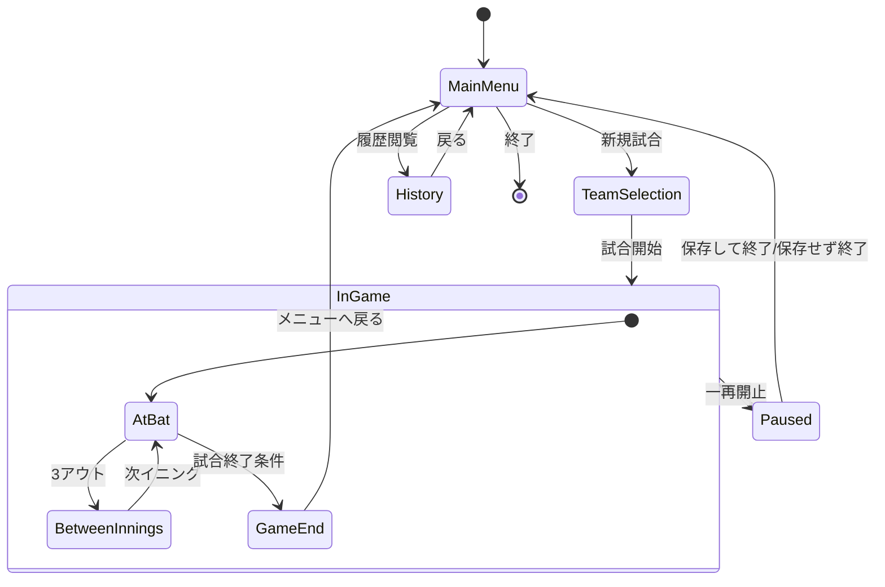
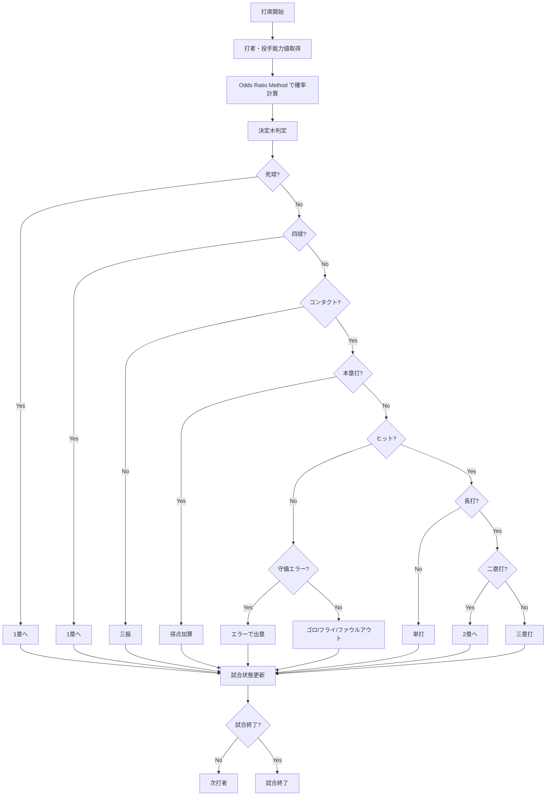
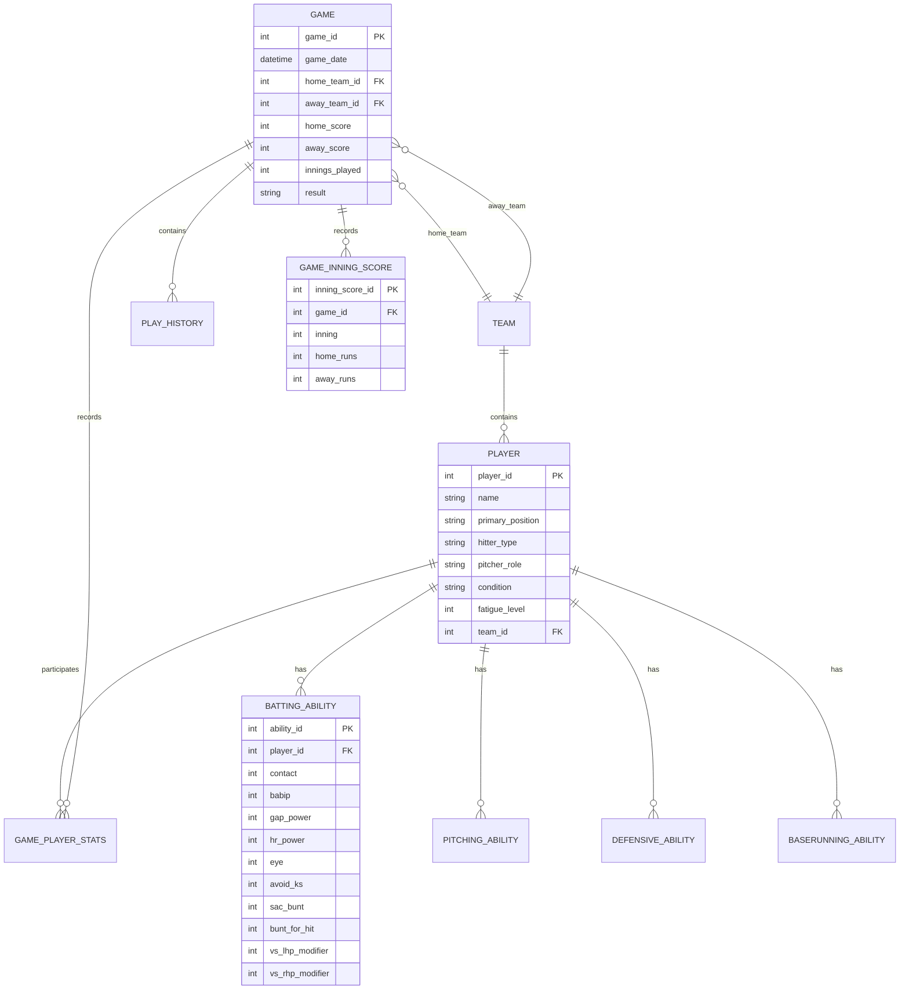

# 技術設計書

## 概要

**目的**: 本機能は、Out of the Park Baseball 26に触発された詳細な選手能力システムを持つ、プレイヤーが監督として戦術指示を出すテキストベースの野球シミュレーションゲームを提供する。

**ユーザー**: 野球ファン、戦術シミュレーションゲーム愛好者、監督体験を求めるプレイヤーが、1試合ずつ戦術的判断を下しながら楽しむ。

**影響**: 新規アプリケーションとして、ローカル環境で動作する完全なテキストベース野球ゲームを構築する。

### Goals

- OOTP26準拠の詳細な選手能力システム（85能力値）を実装
- プレイ毎の戦術指示（バント、盗塁、投手交代等）を可能にする
- Log5/Odds Ratio Methodによるリアルな確率ベース野球シミュレーション
- リアルタイム更新するスコアボードと試合状況の可視化
- 試合履歴と通算戦績の永続化・分析機能
- **選手とチームのカスタマイズ機能**（新規作成、編集、インポート/エクスポート）

### Non-Goals

- マルチプレイヤー機能（将来検討）
- 3Dグラフィックやアニメーション
- オンラインリーグやランキング機能
- リアルタイムMLBデータ連携
- モバイルアプリ版

## Architecture

### Architecture Pattern & Boundary Map

**選択パターン**: State Machine + Layered Architecture

**アーキテクチャ統合**:
- **選択パターン**: 状態機械をゲームフロー管理の中核に、レイヤードアーキテクチャでUI・ロジック・データを分離
- **ドメイン/機能境界**: 
  - Presentation Layer（UI） - Application Layer（制御）- Domain Layer（ビジネスルール）- Data Layer（永続化）の明確な分離
  - 各レイヤー間はインターフェースで疎結合化
- **既存パターンの保持**: 新規プロジェクトのため該当なし
- **新コンポーネントの根拠**:
  - GameStateManager: 試合状態遷移の制御
  - PlaySimulationEngine: 確率計算と結果判定の集約
  - AbilityCalculator: OOTP26能力値計算の集約
  - DataPersistenceLayer: SQLite操作の抽象化
- **ステアリング準拠**: 型安全性、明確な責任分離、テスト容易性を重視

```mermaid
graph TB
    subgraph Presentation["Presentation Layer"]
        MainMenuScreen[Main Menu Screen]
        GameScreen[Game Screen]
        HistoryScreen[History Screen]
        PlayerEditorScreen[Player Editor Screen]
        TeamManagerScreen[Team Manager Screen]
        SettingsScreen[Settings Screen]
        TutorialScreen[Tutorial Screen]
        Widgets[UI Widgets]
    end
    
    subgraph Application["Application Layer"]
        GameController[Game Controller]
        StateManager[Game State Manager]
        InputHandler[Input Handler]
        ImportExportService[Import Export Service]
        SettingsManager[Settings Manager]
        TemplateManager[Template Manager]
    end
    
    subgraph Domain["Domain Layer"]
        PlaySimulationEngine[Play Simulation Engine]
        AbilityCalc[Ability Calculator]
        GameFlowManager[Game Flow Manager]
        GameStatsManager[Game Stats Manager]
        PlayerManager[Player Manager]
        BackupManager[Backup Manager]
    end
    
    subgraph Data["Data Layer"]
        DataPersistence[Data Persistence Layer]
        PlayerRepository[Player Repository]
        HistoryRepository[History Repository]
        HistoryFileStore[History File Store]
        TeamRepository[Team Repository]
        TemplateStore[Template Store]
    end
    
    subgraph External["External Storage"]
        SQLiteDB[(SQLite DB)]
        ConfigJSON[Config JSON]
        BackupFiles[Backup Files]
        HistoryJSON[History JSON]
        SettingsJSON[Settings JSON]
        TemplateFiles[Template Files]
    end
    
    Presentation --> Application
    Application --> Domain
    Domain --> Data
    Data --> External
```



### Technology Stack

| Layer | Choice / Version | Role in Feature | Notes |
|-------|------------------|-----------------|-------|
| Frontend / CLI | Textual 0.80+ | 対話型TUI構築、リアルタイムUI更新 | イベント駆動型UIフレームワーク |
| Frontend / CLI | Rich 13.7+ | テキスト装飾、テーブル、ログ表示 | Textualと組み合わせて使用 |
| Backend / Services | Python 3.11+ | アプリケーションロジック、ドメインロジック | 型ヒント、dataclasses活用 |
| Backend / Services | python-statemachine 2.5+ | ゲーム状態管理 | 状態遷移の明示的制御 |
| Data / Storage | SQLite 3.40+ | 選手データ、試合履歴の永続化 | Python標準ライブラリで完全サポート |
| Data / Storage | JSON | ゲーム設定、リーグ平均データ | 設定ファイルの可読性 |
| Infrastructure / Runtime | Python venv | 依存関係の隔離 | プロジェクト固有の環境管理 |

**根拠**:
- **Textual**: 対話型TUI構築に最適。リアルタイムスコアボード更新、メニュー操作、ボタンUIを実現。クロスプラットフォーム対応。
- **SQLite**: 85能力値×数十人の選手データを効率的にクエリ・管理。単一ファイルで配布容易。
- **python-statemachine**: ゲーム状態の明確な管理。不正な状態遷移を防止。
- **詳細な技術評価は`research.md`を参照**

## System Flows

### 試合フロー全体



**フロー判断**:
- 状態機械により不正な遷移（試合中に新規試合開始など）を防止
- 各状態でのユーザーアクションを厳密に制限

### プレイ判定フロー（確率ベース）



**判定ロジック**:
- 各分岐点で確率を計算し、乱数で判定
- OOTP26能力値（Contact, Power, Eye等）を確率計算に使用
- 決定木により確率の合計=1を保証
- アウト種別にファウルフライ/守備エラー/タッチアップ判定を含める

## Requirements Traceability

| Requirement | Summary | Components | Interfaces | Flows |
|-------------|---------|------------|------------|-------|
| 1.1-1.5 | 試合の初期化と開始 | GameController, StateManager | GameController.start_game() | 試合フロー全体 |
| 1.6-1.10 | イニング進行管理 | GameFlowManager, StateManager | GameFlowManager.advance_inning() | 試合フロー全体 |
| 1.11-1.18 | 試合終了条件判定 | GameFlowManager, GameController | GameFlowManager.check_game_end() | 試合フロー全体 |
| 2.1-2.10 | 攻撃側指示システム | InputHandler, PlaySimulationEngine | InputHandler.get_offensive_decision() | - |
| 2.11-2.15 | 守備側指示システム | InputHandler, PlayerManager | PlayerManager.substitute_pitcher() | - |
| 2.16-2.23 | 指示実行とフィードバック | PlaySimulationEngine, UIRenderer | PlaySimulationEngine.simulate_at_bat() | プレイ判定フロー |
| 3.1-3.30 | プレイ結果判定 | PlaySimulationEngine, AbilityCalculator | PlaySimulationEngine.simulate_at_bat() | プレイ判定フロー |
| 4.1-4.85 | 選手能力管理（OOTP26） | PlayerAbility, AbilityCalculator, PlayerRepository | PlayerAbility.get_contact(), etc. | - |
| 5.1-5.30 | 試合状況可視化 | GameScreen, Widgets, UIRenderer | GameScreen.update_scoreboard() | - |
| 6.1-6.25 | 勝敗判定/試合統計 | GameFlowManager, GameStatsManager | GameFlowManager.determine_winner() | 試合フロー全体 |
| 7.1-7.30 | エラーハンドリング | ErrorHandler, StateManager | ErrorHandler.handle_invalid_input() | - |
| 7.16-7.30 | 設定/アクセシビリティ | SettingsManager, SettingsScreen, UIRenderer | SettingsManager.load_settings() | - |
| 8.1-8.40 | 試合履歴管理 | HistoryRepository, HistoryScreen, HistoryFileStore | HistoryRepository.save_game() | - |
| 9.1-9.5 | 選手データ初期化 | PlayerRepository, DataPersistenceLayer | PlayerRepository.load_default_players() | - |
| 9.6-9.15 | 選手一覧と検索 | PlayerEditorScreen, PlayerRepository | PlayerEditorScreen.filter_players() | - |
| 9.16-9.24 | 選手新規作成 | PlayerEditorScreen, PlayerRepository | PlayerRepository.save_player() | - |
| 9.25-9.34 | 選手編集と削除 | PlayerEditorScreen, PlayerRepository | PlayerRepository.update_player() | - |
| 9.35-9.40 | チーム管理 | TeamManagerScreen, TeamRepository | TeamRepository.save_team() | - |
| 9.41-9.50 | インポート/エクスポート | ImportExportService, PlayerRepository | ImportExportService.export_players() | - |
| 9.51-9.55 | テンプレート機能 | PlayerEditorScreen, TemplateManager, TemplateStore | PlayerEditorScreen.apply_template() | - |
| 9.56-9.60 | バッチ編集 | PlayerEditorScreen, PlayerRepository | PlayerRepository.batch_update() | - |
| 9.61-9.68 | バックアップと復元 | BackupManager, DataPersistenceLayer | BackupManager.create_backup() | - |
| 9.69-9.72 | ヘルプとドキュメント | PlayerEditorScreen, UIRenderer | UIRenderer.show_help() | - |

## Components and Interfaces

### Component Summary

| Component | Domain/Layer | Intent | Req Coverage | Key Dependencies (P0/P1) | Contracts |
|-----------|--------------|--------|--------------|--------------------------|-----------|
| GameController | Application | ゲーム全体の制御と調整 | 1, 2, 6 | StateManager (P0), GameFlowManager (P0) | Service |
| GameStateManager | Application | 状態機械による状態管理 | 1, 7 | python-statemachine (P0) | State |
| ImportExportService | Application | 選手データのインポート/エクスポート | 9 | PlayerRepository (P0) | Service |
| TemplateManager | Application | テンプレート管理 | 9 | TemplateStore (P0) | Service |
| PlaySimulationEngine | Domain | 確率計算とプレイ判定 | 2, 3 | AbilityCalculator (P0), PlayerAbility (P0) | Service |
| AbilityCalculator | Domain | OOTP26能力値計算 | 3, 4 | PlayerAbility (P0) | Service |
| PlayerAbility | Domain | 選手能力データモデル | 4, 9 | なし | Data Model |
| PlayerManager | Domain | 選手交代・管理 | 2, 4 | PlayerRepository (P0) | Service |
| GameFlowManager | Domain | イニング進行・終了判定 | 1, 6 | なし | Service |
| GameStatsManager | Domain | 試合統計（安打/エラー/残塁）集計 | 6, 8 | なし | Service |
| BackupManager | Domain | データバックアップと復元 | 9 | DataPersistenceLayer (P0) | Service |
| DataPersistenceLayer | Data | SQLite操作の抽象化 | 4, 8, 9 | sqlite3 (P0) | Service |
| PlayerRepository | Data | 選手データCRUD | 4, 9 | DataPersistenceLayer (P0) | Service |
| HistoryRepository | Data | 試合履歴CRUD（DB/JSON両方） | 8 | DataPersistenceLayer (P0), HistoryFileStore (P0) | Service |
| HistoryFileStore | Data | 履歴JSONの読み書き | 8 | json (P0) | Service |
| TemplateStore | Data | テンプレートの保存/読込 | 9 | json (P0) | Service |
| TeamRepository | Data | チームデータCRUD | 9 | DataPersistenceLayer (P0) | Service |
| GameScreen | Presentation | 試合画面UI | 5 | Textual (P0), UIRenderer (P0) | UI Component |
| MainMenuScreen | Presentation | メインメニューUI | 1, 9 | Textual (P0) | UI Component |
| HistoryScreen | Presentation | 履歴画面UI | 8 | Textual (P0), HistoryRepository (P0) | UI Component |
| PlayerEditorScreen | Presentation | 選手編集画面UI | 9 | Textual (P0), PlayerRepository (P0) | UI Component |
| TeamManagerScreen | Presentation | チーム管理画面UI | 9 | Textual (P0), TeamRepository (P0) | UI Component |
| SettingsScreen | Presentation | 設定画面UI | 7 | Textual (P0), SettingsManager (P0) | UI Component |
| TutorialScreen | Presentation | 初回チュートリアル画面 | 7 | Textual (P0), UIRenderer (P0) | UI Component |
| UIRenderer | Presentation | UI更新とフォーマット | 5 | Rich (P0) | Service |
| InputHandler | Application | ユーザー入力処理 | 2, 7 | GameScreen (P0) | Service |
| ErrorHandler | Application | エラー処理と復旧 | 7 | なし | Service |
| SettingsManager | Application | 設定の読み書き/適用 | 7 | json (P0) | Service |

### Application Layer

#### GameController

| Field | Detail |
|-------|--------|
| Intent | ゲーム全体のライフサイクルを管理し、各コンポーネントを調整する |
| Requirements | 1.1, 1.2, 1.3, 1.4, 1.5, 2.3, 6.20 |

**Responsibilities & Constraints**
- ゲームの起動、試合開始、終了処理を管理
- StateManager経由で状態遷移を制御
- 各ドメインサービス（PlaySimulationEngine, GameFlowManager）を調整
- 守備指示の実行後に攻撃側打席を再開
- トランザクション境界: 1試合単位

**Dependencies**
- Inbound: MainMenuScreen, GameScreen — ユーザーアクション伝達 (P0)
- Outbound: GameStateManager — 状態管理 (P0)
- Outbound: GameFlowManager — 試合進行 (P0)
- Outbound: DataPersistenceLayer — データ保存 (P0)

**Contracts**: Service [x] / API [ ] / Event [ ] / Batch [ ] / State [x]

##### Service Interface

```python
from dataclasses import dataclass
from typing import Optional
from enum import Enum

class GameResult(Enum):
    WIN = "win"
    LOSS = "loss"
    DRAW = "draw"

@dataclass
class GameConfig:
    home_team_id: int
    away_team_id: int
    max_innings: int = 9
    mercy_rule_enabled: bool = True
    mercy_rule_runs: int = 10

class GameController:
    def start_new_game(self, config: GameConfig) -> None:
        """新規試合を開始する"""
        ...
    
    def resume_game(self, game_id: int) -> None:
        """保存された試合を再開する"""
        ...
    
    def save_current_game(self) -> int:
        """現在の試合を保存する。game_idを返す"""
        ...
    
    def pause_game(self) -> None:
        """試合を一時停止する"""
        ...
    
    def resume_paused_game(self) -> None:
        """一時停止中の試合を再開する"""
        ...
    
    def abandon_game(self, save: bool) -> None:
        """試合を中断する（save=Falseの場合はノーゲーム扱い）"""
        ...
    
    def end_game(self) -> GameResult:
        """試合を終了し結果を返す"""
        ...
```

- **Preconditions**: start_new_gameではチームIDが存在すること
- **Postconditions**: 試合状態がInGameに遷移
- **Invariants**: 同時に複数の試合セッションは存在しない

**Implementation Notes**
- **Integration**: StateManagerと密連携、状態変更はStateManager経由
- **Validation**: チームIDの存在確認、game_idの有効性確認
- **Integration**: イニング終了時に自動保存（Requirement 7.9）
- **Integration**: 起動時にクラッシュ検知で「前回の試合を復元しますか？」を提示
- **Integration**: 試合終了時にGameStatsManagerのサマリーを取得し表示
- **Risks**: 試合中のクラッシュ → 自動保存機能で緩和（Requirement 7.6-7.10参照）

#### GameStateManager

| Field | Detail |
|-------|--------|
| Intent | 状態機械パターンでゲーム状態の遷移を管理 |
| Requirements | 1.6, 1.8, 1.9, 7.11, 7.12, 7.13 |

**Responsibilities & Constraints**
- ゲーム状態（MainMenu, TeamSelection, InGame, GameEnd, History）の管理
- 状態遷移の検証と実行
- 各状態でのonEnter/onExit処理
- ドメイン境界: ゲーム状態のみを管理、ビジネスルールは含まない

**Dependencies**
- Inbound: GameController, InputHandler — 状態変更要求 (P0)
- Outbound: なし
- External: python-statemachine — 状態機械ライブラリ (P0)

**Contracts**: Service [x] / API [ ] / Event [x] / Batch [ ] / State [x]

##### Service Interface

```python
from enum import Enum
from typing import Callable

class GameState(Enum):
    MAIN_MENU = "main_menu"
    TEAM_SELECTION = "team_selection"
    IN_GAME = "in_game"
    PAUSED = "paused"
    GAME_END = "game_end"
    HISTORY = "history"

class InGameSubState(Enum):
    AT_BAT = "at_bat"
    BETWEEN_INNINGS = "between_innings"
    PITCHER_CHANGE = "pitcher_change"

class GameStateManager:
    def transition_to(self, state: GameState) -> bool:
        """指定状態への遷移を試みる。成功時True"""
        ...
    
    def get_current_state(self) -> GameState:
        """現在の状態を返す"""
        ...
    
    def can_transition_to(self, state: GameState) -> bool:
        """指定状態への遷移が可能か判定"""
        ...
    
    def register_state_enter_callback(
        self, state: GameState, callback: Callable[[], None]
    ) -> None:
        """状態入場時のコールバックを登録"""
        ...
```

##### Event Contract

- **Published events**: StateChangedEvent（state: GameState, timestamp: datetime）
- **Subscribed events**: なし
- **Ordering / delivery guarantees**: 同期イベント、順序保証あり

**Implementation Notes**
- **Integration**: python-statemachineライブラリの@transition デコレータを使用
- **Validation**: 遷移可能性をcan_transition_toで事前確認
- **Risks**: 状態数が増えると複雑化 → 図表化で管理（research.mdの状態図参照）

#### InputHandler

| Field | Detail |
|-------|--------|
| Intent | ユーザー入力を受け取り、検証し、適切なコマンドに変換 |
| Requirements | 2.1, 2.2, 2.3, 7.1, 7.2, 7.3 |

**Responsibilities & Constraints**
- ユーザーからの指示選択を受信
- 入力の妥当性検証（無効な指示、範囲外の数値）
- エラーメッセージの表示とリトライ促進
- 指示選択肢に番号を付与し数字入力を許可
- 走者状況に応じて指示選択肢を切替（盗塁/エンドラン/スクイズ/ダブルスチール）
- 守備シフトは種類を選択して適用（右打ちシフト/極端シフトなど）
- ドメイン境界: UI入力とドメインコマンドの変換のみ

**Dependencies**
- Inbound: GameScreen, Widgets — ユーザーイベント (P0)
- Outbound: ErrorHandler — エラー処理 (P0)
- Outbound: GameController — コマンド伝達 (P0)

**Contracts**: Service [x] / API [ ] / Event [ ] / Batch [ ] / State [ ]

##### Service Interface

```python
from dataclasses import dataclass
from enum import Enum
from typing import Optional

class OffensiveDecision(Enum):
    NORMAL_SWING = "normal_swing"
    BUNT = "bunt"
    SQUEEZE = "squeeze"
    STEAL = "steal"
    DOUBLE_STEAL = "double_steal"
    HIT_AND_RUN = "hit_and_run"
    WAIT = "wait"

class DefensiveDecision(Enum):
    PITCH = "pitch"
    PITCHER_CHANGE = "pitcher_change"
    INTENTIONAL_WALK = "intentional_walk"
    DEFENSIVE_SHIFT = "defensive_shift"

class DefensiveShiftType(Enum):
    RIGHT_SHIFT = "right_shift"
    EXTREME_SHIFT = "extreme_shift"

@dataclass
class PlayerDecision:
    decision_type: OffensiveDecision | DefensiveDecision
    target_player_id: Optional[int] = None  # 選手交代時
    shift_type: Optional[DefensiveShiftType] = None  # 守備シフト時

class ValidationError(Exception):
    user_message: str

class InputHandler:
    def get_offensive_decision(self) -> PlayerDecision:
        """攻撃側の指示を取得（ブロッキング）"""
        ...
    
    def get_defensive_decision(self) -> PlayerDecision:
        """守備側の指示を取得（ブロッキング）"""
        ...
    
    def validate_decision(
        self, decision: PlayerDecision
    ) -> tuple[bool, Optional[str]]:
        """指示の妥当性を検証。(valid, error_message)を返す"""
        ...
```

- **Preconditions**: GameStateがInGame状態
- **Postconditions**: 妥当なPlayerDecisionを返すまでリトライ
- **Invariants**: 不正な入力は決してドメイン層に到達しない

**Implementation Notes**
- **Integration**: Textualのイベントループと統合、非同期入力を同期変換
- **Validation**: 現在の試合状況（ランナー有無、アウトカウント、ストライク数）に応じた検証
- **Warnings**: 2ストライク時のバント成功率低下、ツーアウト時の盗塁警告、走力低い場合のリスク警告
- **Behavior**: 指示選択のタイムアウトは設けず、待機し続ける
- **Risks**: ユーザーが無限に誤入力 → 3回エラーでヘルプ表示（Requirement 7.5）

#### ErrorHandler

| Field | Detail |
|-------|--------|
| Intent | エラーの検出、分類、復旧処理を一元管理 |
| Requirements | 7.1, 7.2, 7.6, 7.7, 7.8 |

**Responsibilities & Constraints**
- 3種類のエラー分類（ユーザーエラー、システムエラー、ビジネスルールエラー）
- エラーメッセージの多言語対応
- システムエラー時の自動保存とログ記録
- 入力エラー時に警告記号（[!]）を表示
- 保存失敗時に再試行オプションを提示
- ドメイン境界: エラー処理のみ、ビジネスロジックは含まない

**Dependencies**
- Inbound: 全コンポーネント — エラー通知 (P0)
- Outbound: DataPersistenceLayer — 緊急保存 (P0)
- Outbound: UIRenderer — エラー表示 (P0)

**Contracts**: Service [x] / API [ ] / Event [ ] / Batch [ ] / State [ ]

##### Service Interface

```python
from enum import Enum
from dataclasses import dataclass
from typing import Optional

class ErrorSeverity(Enum):
    INFO = "info"          # ユーザー入力ミス
    WARNING = "warning"    # ビジネスルール違反
    ERROR = "error"        # 復旧可能なシステムエラー
    CRITICAL = "critical"  # 復旧不可能なエラー

@dataclass
class GameError:
    severity: ErrorSeverity
    message: str
    user_message: str
    stacktrace: Optional[str] = None

class ErrorHandler:
    def handle_error(self, error: GameError) -> None:
        """エラーを処理し、適切な復旧処理を実行"""
        ...
    
    def save_error_log(self, error: GameError) -> None:
        """エラーをログファイルに記録"""
        ...
    
    def emergency_save_game(self) -> bool:
        """システムエラー時に試合を緊急保存"""
        ...
```

- **Preconditions**: なし
- **Postconditions**: CRITICALエラー時は試合データを保存
- **Invariants**: 全エラーがログに記録される

**Implementation Notes**
- **Integration**: Python loggingモジュールと統合、`~/.baseball_game/error.log`に出力
- **Validation**: なし（エラーハンドラー自体はエラーをスローしない）
- **Risks**: ログファイル肥大化 → ローテーション設定（1MB/日、7日保存）

#### SettingsManager

| Field | Detail |
|-------|--------|
| Intent | 言語・表示速度など設定の読み書き/適用を管理 |
| Requirements | 7.16-7.30 |

**Responsibilities & Constraints**
- 設定ファイルの読み込み/保存
- 表示言語（日本語/英語）とテキスト表示速度の管理
- ターミナル幅に応じたレイアウト設定の保持
- ドメイン境界: 設定データのみ、ビジネスロジックは含まない

**Dependencies**
- Inbound: MainMenuScreen, SettingsScreen — 設定要求 (P0)
- Outbound: UIRenderer — 設定反映 (P0)
- External: Python json module (P0)

**Contracts**: Service [x] / API [ ] / Event [ ] / Batch [ ] / State [ ]

##### Service Interface

```python
from dataclasses import dataclass

@dataclass
class GameSettings:
    language: str  # "ja" or "en"
    text_speed: str  # "instant" or "step"
    difficulty: str  # "easy", "normal", "hard"

class SettingsManager:
    def load_settings(self, path: str = "~/.baseball_game/settings.json") -> GameSettings:
        """設定を読み込む。存在しない場合はデフォルトを返す"""
        ...
    
    def save_settings(self, settings: GameSettings, path: str = "~/.baseball_game/settings.json") -> None:
        """設定を保存する"""
        ...
```

**Implementation Notes**
- **Integration**: 起動時に読み込み、変更時に即時保存
- **Validation**: 設定値の許容範囲チェック（language/text_speed/difficulty）
- **Risks**: 設定ファイル破損 → デフォルト復元と警告表示

#### TemplateManager

| Field | Detail |
|-------|--------|
| Intent | 選手テンプレートの保存/取得を管理 |
| Requirements | 9.51-9.55 |

**Responsibilities & Constraints**
- テンプレート一覧の取得
- テンプレートの保存/削除
- テンプレートの適用（能力値セット）
- ドメイン境界: テンプレート管理のみ

**Dependencies**
- Inbound: PlayerEditorScreen — テンプレート操作 (P0)
- Outbound: TemplateStore — 永続化 (P0)

**Contracts**: Service [x] / API [ ] / Event [ ] / Batch [ ] / State [ ]

##### Service Interface

```python
from dataclasses import dataclass
from typing import List

@dataclass
class PlayerTemplate:
    name: str
    abilities: dict[str, int]

class TemplateManager:
    def list_templates(self) -> List[PlayerTemplate]:
        """テンプレート一覧を取得"""
        ...
    
    def save_template(self, template: PlayerTemplate) -> None:
        """テンプレートを保存"""
        ...
    
    def delete_template(self, name: str) -> None:
        """テンプレートを削除"""
        ...
```

**Implementation Notes**
- **Integration**: `~/.baseball_game/templates/` にJSON保存
- **Validation**: 能力値が1-100範囲内
- **Risks**: テンプレート名重複 → 保存時に上書き確認

#### ImportExportService

| Field | Detail |
|-------|--------|
| Intent | 選手データのJSON形式でのインポート/エクスポートを管理 |
| Requirements | 9.41-9.50 |

**Responsibilities & Constraints**
- 選手データのJSON形式へのシリアライズ
- JSONファイルからの選手データデシリアライズ
- インポート時のバリデーションと重複チェック
- エクスポートファイル名の自動生成（日時付き）
- ドメイン境界: データ変換のみ、ビジネスルールは含まない

**Dependencies**
- Inbound: PlayerEditorScreen — インポート/エクスポート要求 (P0)
- Outbound: PlayerRepository — データ取得/保存 (P0)
- External: Python json module (P0)

**Contracts**: Service [x] / API [ ] / Event [ ] / Batch [ ] / State [ ]

##### Service Interface

```python
from dataclasses import dataclass
from typing import List, Optional
from enum import Enum

class DuplicateResolution(Enum):
    OVERWRITE = "overwrite"
    SKIP = "skip"
    RENAME = "rename"

@dataclass
class ImportResult:
    imported_count: int
    skipped_count: int
    errors: List[str]

@dataclass
class ExportOptions:
    export_all: bool = True
    team_ids: Optional[List[int]] = None
    player_ids: Optional[List[int]] = None

class ImportExportService:
    def export_players(
        self,
        output_path: str,
        options: ExportOptions
    ) -> int:
        """選手データをJSONファイルにエクスポート。エクスポート数を返す"""
        ...
    
    def import_players(
        self,
        input_path: str,
        duplicate_resolution: DuplicateResolution
    ) -> ImportResult:
        """JSONファイルから選手データをインポート"""
        ...
    
    def validate_json_format(self, json_data: dict) -> tuple[bool, Optional[str]]:
        """JSONフォーマットのバリデーション。(valid, error_message)を返す"""
        ...
    
    def check_duplicate_players(
        self,
        new_players: List[PlayerData]
    ) -> List[tuple[PlayerData, PlayerData]]:
        """重複選手を検出。[(新選手, 既存選手)]のリストを返す"""
        ...
```

- **Preconditions**: ファイルパスが有効、read/write権限がある
- **Postconditions**: エクスポート成功時はファイルが生成される
- **Invariants**: JSONフォーマットは常にバリデート済み

**Implementation Notes**
- **Integration**: エクスポートファイルは`~/.baseball_game/exports/players_export_YYYY-MM-DD_HH-MM-SS.json`に保存
- **Integration**: サンプルファイル`data/sample_player.json`を提供
- **Validation**: JSON schema検証、必須フィールド確認、能力値範囲チェック
- **Risks**: 大量選手データでメモリ不足 → ストリーミング処理を検討

### Domain Layer

#### PlaySimulationEngine

| Field | Detail |
|-------|--------|
| Intent | 確率ベースの野球プレイ判定を実行し、試合状態を更新 |
| Requirements | 3.1-3.30（全プレイ判定） |

**Responsibilities & Constraints**
- Odds Ratio Method（Log5）で打者-投手対決の確率を計算
- 決定木アプローチで打席結果を段階的に判定
- ランナー進塁ロジックの実行（タッチアップ、守備エラー含む）
- バント/スクイズ/盗塁/ダブルスチールの専用判定ロジック
- 敬遠は即時四球として処理
- OOTP26能力値を確率計算に統合
- トランザクション境界: 1プレイ単位

**Dependencies**
- Inbound: GameController — プレイ実行要求 (P0)
- Outbound: AbilityCalculator — 能力値計算 (P0)
- Outbound: PlayerAbility — 選手データ取得 (P0)
- External: Python random module — 乱数生成 (P0)

**Contracts**: Service [x] / API [ ] / Event [ ] / Batch [ ] / State [ ]

##### Service Interface

```python
from dataclasses import dataclass
from enum import Enum
from typing import List

class PlayOutcome(Enum):
    HIT_BY_PITCH = "hit_by_pitch"
    WALK = "walk"
    STRIKEOUT = "strikeout"
    FOUL_FLY = "foul_fly"
    SINGLE = "single"
    DOUBLE = "double"
    TRIPLE = "triple"
    HOME_RUN = "home_run"
    GROUND_OUT = "ground_out"
    FLY_OUT = "fly_out"
    DOUBLE_PLAY = "double_play"
    ERROR = "error"
    SAC_FLY = "sac_fly"

@dataclass
class PlayResult:
    outcome: PlayOutcome
    runs_scored: int
    outs_recorded: int
    runners_advanced: List[int]  # 各塁のランナーが進んだ塁数
    description: str  # 実況テキスト
    home_score_after: int
    away_score_after: int

class PlaySimulationEngine:
    def simulate_at_bat(
        self,
        batter_id: int,
        pitcher_id: int,
        outs: int,
        runners_on_base: List[int],  # [1塁, 2塁, 3塁]のplayer_id（Noneは空）
        decision: OffensiveDecision
    ) -> PlayResult:
        """打席をシミュレートし結果を返す"""
        ...
    
    def calculate_probability(
        self,
        batter_ability: float,
        pitcher_ability: float,
        league_avg: float
    ) -> float:
        """Odds Ratio Method (Log5)で確率を計算"""
        ...
    
    def simulate_steal_attempt(
        self,
        runner_id: int,
        pitcher_id: int,
        catcher_id: int
    ) -> bool:
        """盗塁の成否を判定。成功時True"""
        ...

    def simulate_double_steal(
        self,
        runner_ids: List[int],
        pitcher_id: int,
        catcher_id: int
    ) -> List[bool]:
        """ダブルスチールの成否を判定。各走者の成功可否を返す"""
        ...

    def simulate_bunt(
        self,
        batter_id: int,
        runners_on_base: List[int],
        strikes: int
    ) -> PlayResult:
        """バントの成否と進塁を判定（2ストライク時は成功率低下）"""
        ...

    def simulate_squeeze(
        self,
        batter_id: int,
        runner_on_third: int,
        strikes: int
    ) -> PlayResult:
        """スクイズの成否と得点を判定（失敗時は三塁走者アウトのリスク）"""
        ...

    def simulate_fielding_error(
        self,
        fielder_ids: List[int]
    ) -> bool:
        """守備エラーの有無を判定（守備能力/適性を考慮）。エラー時True"""
        ...

    def simulate_tag_up(
        self,
        runner_id: int,
        fielder_arm: int
    ) -> bool:
        """タッチアップ成否を判定。成功時True"""
        ...
```

- **Preconditions**: batter_id, pitcher_idが有効、能力値データが存在
- **Postconditions**: PlayResultの合計確率が論理的に一貫
- **Invariants**: 決定木の各分岐で確率合計=1

**Implementation Notes**
- **Integration**: リーグ平均データを`config/league_averages.json`から読込
- **Validation**: 能力値が1-100範囲内、確率が0-1範囲内
- **Rules**: 通常打撃は打者の打率を基準確率として使用
- **Rules**: 左打者は一塁到達時間を0.2秒短縮として判定に反映
- **Rules**: 左打者バントは成功率を5-10%上昇
- **Rules**: エンドランでゴロ時は走者進塁成功率を上昇
- **Rules**: 単打は1・2塁走者は確実進塁、3塁走者は確率で本塁生還
- **Rules**: 二塁打は全走者が最低2塁進塁、本塁打は全走者が得点
- **Rules**: 守備はPositionRatingsに応じて能力ペナルティを適用
- **Risks**: 確率計算のバランス調整 → MLB 2025データで検証、調整用デバッグモード実装（research.md Risk 2参照）
- **Risks**: 守備エラー/タッチアップ判定の複雑化 → ルール別ユニットテストで担保

#### AbilityCalculator

| Field | Detail |
|-------|-----__|
| Intent | OOTP26準拠の85能力値から実際のプレイ確率を計算 |
| Requirements | 3.1, 3.6, 3.7, 3.9, 3.10, 4.1-4.85 |

**Responsibilities & Constraints**
- Contact, BABIP, Gap Power, HR Power等の能力値から打撃確率を算出
- Stuff, Movement, Controlから投手能力を算出
- 疲労度、コンディション、対左右補正を適用
- ドメイン境界: 能力値計算のみ、プレイ判定は含まない

**Dependencies**
- Inbound: PlaySimulationEngine — 能力値計算要求 (P0)
- Outbound: PlayerAbility — 選手データ取得 (P0)

**Contracts**: Service [x] / API [ ] / Event [ ] / Batch [ ] / State [ ]

##### Service Interface

```python
from dataclasses import dataclass

@dataclass
class BattingProbabilities:
    contact_rate: float       # コンタクト率（三振回避）
    babip: float              # インプレーヒット率
    gap_power_rate: float     # 長打率（二塁打・三塁打）
    hr_rate: float            # 本塁打率
    walk_rate: float          # 四球率

@dataclass
class PitchingProbabilities:
    strikeout_rate: float     # 奪三振率
    walk_rate: float          # 与四球率
    hr_allowed_rate: float    # 被本塁打率
    babip_allowed: float      # 被BABIP

class AbilityCalculator:
    def calculate_batting_probabilities(
        self,
        batter_id: int,
        pitcher_handedness: str,  # "L" or "R"
        condition: str  # "excellent", "good", "normal", "poor", "terrible"
    ) -> BattingProbabilities:
        """打者の各プレイ確率を計算"""
        ...
    
    def calculate_pitching_probabilities(
        self,
        pitcher_id: int,
        pitch_count: int,
        fatigue_level: str  # "fresh", "normal", "tired", "exhausted"
    ) -> PitchingProbabilities:
        """投手の各プレイ確率を計算"""
        ...
    
    def apply_fatigue_penalty(
        self,
        base_ability: float,
        fatigue_level: str
    ) -> float:
        """疲労度による能力減衰を適用"""
        ...

    def calculate_overall_rating_batter(
        self,
        contact: int,
        gap_power: int,
        hr_power: int,
        eye: int,
        speed: int
    ) -> float:
        """打者OVRを計算（Contact 30%、Gap/HR Power 40%、Eye 15%、Speed 15%）"""
        ...

    def calculate_overall_rating_pitcher(
        self,
        stuff: int,
        movement: int,
        control: int
    ) -> float:
        """投手OVRを計算（Stuff 40%、Movement 35%、Control 25%）"""
        ...
```

- **Preconditions**: player_idが存在、能力値データが有効
- **Postconditions**: 全確率が0-1範囲内
- **Invariants**: 能力値の計算式は変更されない（設定ファイルで調整）

**Implementation Notes**
- **Integration**: 計算式を`config/ability_formulas.json`で外部化し調整可能に
- **Validation**: 能力値範囲チェック（1-100）、確率範囲チェック（0-1）
- **Rules**: 投球数に応じて疲労度を段階分類（0-50: 新鮮、51-75: 普通、76-100: 疲労、101+: 限界）
- **Rules**: 疲労でStuff/Controlを段階的に低下（疲労: Stuff-5〜10%、Control-10〜15%、限界: Stuff-15〜20%、Control-20〜25%）
- **Rules**: Stamina閾値超過時は追加で能力を5%ずつ低下
- **Risks**: 計算式の複雑化 → ユニットテストで各能力値パターンを網羅

#### GameFlowManager

| Field | Detail |
|-------|--------|
| Intent | イニング進行、得点管理、試合終了条件の判定 |
| Requirements | 1.6-1.18, 6.1-6.25 |

**Responsibilities & Constraints**
- イニング管理（表/裏、攻守交代）
- 得点の加算とスコアボード更新
- 試合終了条件の判定（9回終了、延長戦、サヨナラ、コールド）
- 試合時間（プレイ時間）の計測
- トランザクション境界: 1イニング単位

**Dependencies**
- Inbound: GameController — イニング進行要求 (P0)
- Outbound: なし

**Contracts**: Service [x] / API [ ] / Event [x] / Batch [ ] / State [ ]

##### Service Interface

```python
from dataclasses import dataclass
from typing import Optional

@dataclass
class GameStatus:
    inning: int
    is_top: bool  # True=表, False=裏
    outs: int
    balls: int
    strikes: int
    home_score: int
    away_score: int
    is_game_over: bool
    game_end_reason: Optional[str]  # "regulation", "extra", "sayonara", "mercy"

class GameFlowManager:
    def advance_inning(self) -> GameStatus:
        """次のイニングに進む。GameStatusを返す"""
        ...
    
    def record_out(self) -> int:
        """アウトを記録。現在のアウトカウントを返す"""
        ...
    
    def add_runs(self, runs: int, team: str) -> None:
        """得点を加算（team: "home" or "away"）"""
        ...
    
    def check_game_end_conditions(self) -> tuple[bool, Optional[str]]:
        """試合終了条件を判定。(is_over, reason)を返す"""
        ...
    
    def determine_winner(self) -> str:
        """勝者を判定（"home", "away", "draw"）"""
        ...
```

##### Event Contract

- **Published events**: InningChangedEvent, GameEndEvent
- **Subscribed events**: なし
- **Ordering / delivery guarantees**: 同期イベント

**Implementation Notes**
- **Integration**: スコアボード更新時にUIRendererにイベント送信
- **Validation**: イニング数の上限チェック（max_innings設定）
- **Rules**: 延長で得点差がついた場合はそのイニング終了時に試合終了
- **Risks**: 延長戦の無限ループ → max_inningsで制限（デフォルト12回）

#### GameStatsManager

| Field | Detail |
|-------|--------|
| Intent | 試合中/試合終了時の統計を集計する |
| Requirements | 6.5, 6.24-6.25, 8.1-8.5 |

**Responsibilities & Constraints**
- チームの安打数/エラー数/残塁数を集計
- 個人成績（打数・安打、投球回・失点など）を集計
- 試合終了時のサマリー/MVP候補/ハイライトを生成
- バント/盗塁など戦術使用回数を集計
- ドメイン境界: 統計集計のみ、表示はUI側

**Dependencies**
- Inbound: GameController, PlaySimulationEngine — 集計更新 (P0)
- Outbound: なし

**Contracts**: Service [x] / API [ ] / Event [ ] / Batch [ ] / State [ ]

##### Service Interface

```python
from dataclasses import dataclass
from typing import List

@dataclass
class TeamStats:
    hits: int
    errors: int
    left_on_base: int

@dataclass
class GameSummary:
    home_stats: TeamStats
    away_stats: TeamStats
    mvp_player_id: int
    highlights: List[str]
    tactic_counts: dict[str, int]

class GameStatsManager:
    def record_play(self, play_result: PlayResult) -> None:
        """プレイ結果を統計に反映"""
        ...
    
    def get_team_stats(self) -> tuple[TeamStats, TeamStats]:
        """両チームの統計を取得"""
        ...
    
    def build_game_summary(self) -> GameSummary:
        """試合終了時のサマリーを生成"""
        ...
```

**Implementation Notes**
- **Integration**: 試合終了時にUIへ統計サマリーを渡す
- **Validation**: なし（集計専用）
- **Risks**: 集計漏れ → PlayResult全パスのテストで担保

#### PlayerManager

| Field | Detail |
|-------|--------|
| Intent | 選手交代、打順管理、ロースター操作を制御 |
| Requirements | 2.11, 2.12, 4.46-4.52, 4.68-4.75 |

**Responsibilities & Constraints**
- 投手交代、代打、守備固めの実行
- 一度交代した選手の再出場禁止を保証
- 打順の自動引き継ぎ
- 推奨打順の生成
- ドメイン境界: ロースター操作のみ、能力値計算は含まない

**Dependencies**
- Inbound: InputHandler, GameController — 選手交代要求 (P0)
- Outbound: PlayerRepository — 選手データ取得 (P0)

**Contracts**: Service [x] / API [ ] / Event [ ] / Batch [ ] / State [ ]

##### Service Interface

```python
from dataclasses import dataclass
from typing import List

@dataclass
class Lineup:
    batting_order: List[int]  # player_idのリスト（9人）
    fielding_positions: dict[int, str]  # {player_id: "P", "C", "1B", ...}
    bench: List[int]  # ベンチのplayer_id

@dataclass
class SubstitutionRecord:
    inning: int
    player_out_id: int
    player_in_id: int
    substitution_type: str  # "pitcher", "pinch_hitter", "defensive"

class PlayerManager:
    def get_current_lineup(self, team: str) -> Lineup:
        """現在のラインナップを取得"""
        ...
    
    def substitute_pitcher(
        self,
        team: str,
        new_pitcher_id: int
    ) -> SubstitutionRecord:
        """投手交代を実行"""
        ...
    
    def use_pinch_hitter(
        self,
        team: str,
        pinch_hitter_id: int
    ) -> SubstitutionRecord:
        """代打を起用"""
        ...
    
    def validate_substitution(
        self,
        player_in_id: int,
        player_out_id: int
    ) -> tuple[bool, Optional[str]]:
        """交代の妥当性を検証"""
        ...

    def generate_recommended_lineup(self, team: str) -> Lineup:
        """推奨打順を生成"""
        ...
    
    def has_played(self, player_id: int) -> bool:
        """選手が既に出場済みか判定"""
        ...
```

- **Preconditions**: player_idが存在、ラインナップが初期化済み
- **Postconditions**: 交代後の打順が一貫性を保つ
- **Invariants**: 一度交代した選手は再出場不可

**Implementation Notes**
- **Integration**: SubstitutionRecordを試合履歴に保存
- **Validation**: 交代選手の守備適性チェック、再出場禁止チェック
- **Rules**: 代打は当該打席のみ実施し、次守備で正式交代するか確認
- **Rules**: DHなしの場合、投手交代時に新投手を打順へ反映
- **Rules**: 推奨打順はContact/Eye/Gap/HR Powerを加重して生成
- **Risks**: 複雑な交代パターン → ユニットテストで全パターン網羅

#### BackupManager

| Field | Detail |
|-------|--------|
| Intent | データベースの自動バックアップと復元を管理 |
| Requirements | 9.61-9.68 |

**Responsibilities & Constraints**
- 選手データ変更前の自動バックアップ作成
- 最大10世代のバックアップ世代管理
- バックアップからのデータ復元
- データベース整合性チェック
- ドメイン境界: バックアップ管理のみ、データ操作は含まない

**Dependencies**
- Inbound: PlayerRepository, TeamRepository — バックアップ要求 (P0)
- Outbound: DataPersistenceLayer — データベース操作 (P0)
- External: Python shutil module (P0)

**Contracts**: Service [x] / API [ ] / Event [ ] / Batch [ ] / State [ ]

##### Service Interface

```python
from dataclasses import dataclass
from datetime import datetime
from typing import List, Optional

@dataclass
class BackupInfo:
    backup_id: str
    created_at: datetime
    file_path: str
    file_size_bytes: int
    description: Optional[str] = None

class BackupManager:
    def create_backup(self, description: Optional[str] = None) -> BackupInfo:
        """現在のデータベースをバックアップ。BackupInfoを返す"""
        ...
    
    def list_backups(self) -> List[BackupInfo]:
        """利用可能なバックアップ一覧を取得（新しい順）"""
        ...
    
    def restore_backup(self, backup_id: str) -> bool:
        """指定バックアップからデータを復元。成功時True"""
        ...
    
    def delete_old_backups(self, keep_count: int = 10) -> int:
        """古いバックアップを削除。削除数を返す"""
        ...
    
    def check_database_integrity(self) -> tuple[bool, Optional[str]]:
        """データベース整合性をチェック。(valid, error_message)を返す"""
        ...
    
    def auto_restore_from_latest(self) -> bool:
        """最新バックアップから自動復元を試みる"""
        ...
```

- **Preconditions**: バックアップディレクトリが存在または作成可能
- **Postconditions**: バックアップ成功時はファイルが生成される
- **Invariants**: 最大10世代を超えるバックアップは自動削除

**Implementation Notes**
- **Integration**: バックアップファイルは`~/.baseball_game/backups/backup_YYYY-MM-DD_HH-MM-SS.db`に保存
- **Validation**: 復元前にバックアップファイルの整合性確認、SQLite PRAGMA integrity_check使用
- **Risks**: ディスク容量不足 → バックアップ前に空き容量チェック

### Data Layer

#### DataPersistenceLayer

| Field | Detail |
|-------|--------|
| Intent | SQLite操作を抽象化し、データアクセスを一元管理 |
| Requirements | 4.82, 4.83, 4.84, 8.1, 8.26, 8.27, 8.28, 8.29 |

**Responsibilities & Constraints**
- SQLiteコネクション管理
- トランザクション制御
- スキーママイグレーション（Alembic使用）
- エラー時のロールバック
- ドメイン境界: データアクセスのみ、ビジネスルールは含まない

**Dependencies**
- Inbound: PlayerRepository, HistoryRepository — データ操作要求 (P0)
- Outbound: なし
- External: sqlite3 — データベースエンジン (P0)

**Contracts**: Service [x] / API [ ] / Event [ ] / Batch [ ] / State [ ]

##### Service Interface

```python
from typing import List, Optional, Any
from contextlib import contextmanager

class DataPersistenceLayer:
    def __init__(self, db_path: str = "~/.baseball_game/game.db"):
        """データベース接続を初期化"""
        ...
    
    @contextmanager
    def transaction(self):
        """トランザクションコンテキストマネージャ"""
        ...
    
    def execute_query(
        self,
        query: str,
        params: tuple = ()
    ) -> List[tuple]:
        """SELECTクエリを実行"""
        ...
    
    def execute_write(
        self,
        query: str,
        params: tuple = ()
    ) -> int:
        """INSERT/UPDATE/DELETEを実行。affected rowsを返す"""
        ...
    
    def initialize_schema(self) -> None:
        """スキーマを初期化（初回起動時）"""
        ...
```

- **Preconditions**: データベースファイルが存在するか作成可能
- **Postconditions**: トランザクション成功時のみコミット
- **Invariants**: 全データ操作はトランザクション内で実行

**Implementation Notes**
- **Integration**: Alembicでスキーママイグレーション管理、`alembic/versions/`にバージョン保存
- **Validation**: SQL injection防止（パラメータ化クエリのみ許可）
- **Risks**: マイグレーション失敗 → バックアップ機能実装（risk mitigation in research.md）

#### PlayerRepository

| Field | Detail |
|-------|--------|
| Intent | 選手データのCRUD操作を提供 |
| Requirements | 4.1-4.40, 4.47, 4.53, 4.54, 4.55 |

**Responsibilities & Constraints**
- OOTP26準拠の選手能力データの永続化
- 選手検索（ID、名前、ポジション）
- 能力値の更新（コンディション、疲労度）
- トランザクション境界: 選手単位

**Dependencies**
- Inbound: PlayerManager, AbilityCalculator — データ要求 (P0)
- Outbound: DataPersistenceLayer — データ操作 (P0)

**Contracts**: Service [x] / API [ ] / Event [ ] / Batch [ ] / State [ ]

##### Service Interface

```python
from typing import List, Optional

@dataclass
class PlayerData:
    player_id: int
    name: str
    primary_position: str
    overall_rating: float
    hitter_type: str  # "power", "contact", "balanced"
    pitcher_role: Optional[str] = None  # "starter" or "reliever"
    pitch_types: Optional[List[str]] = None  # 先発は3球種、救援は2球種
    batting_abilities: BattingAbilityData
    pitching_abilities: Optional[PitchingAbilityData]
    defensive_abilities: DefensiveAbilityData
    baserunning_abilities: BaserunningAbilityData
    condition: str
    fatigue_level: int

class PlayerRepository:
    def get_player_by_id(self, player_id: int) -> Optional[PlayerData]:
        """IDで選手を取得"""
        ...
    
    def get_players_by_position(self, position: str) -> List[PlayerData]:
        """ポジションで選手を検索"""
        ...

    def get_players(
        self,
        position: Optional[str] = None,
        team_id: Optional[int] = None,
        ability_range: Optional[tuple[int, int]] = None,
        sort_key: Optional[str] = None,
        sort_order: str = "asc",
        limit: int = 50,
        offset: int = 0
    ) -> List[PlayerData]:
        """一覧/検索/並び替え/ページネーションを統合提供"""
        ...
    
    def update_player_condition(
        self,
        player_id: int,
        condition: str
    ) -> None:
        """コンディションを更新"""
        ...
    
    def save_player(self, player: PlayerData) -> int:
        """選手を保存。player_idを返す"""
        ...

    def has_game_history(self, player_id: int) -> bool:
        """選手が試合履歴に含まれるか判定"""
        ...
```

- **Preconditions**: データベースが初期化済み
- **Postconditions**: データ整合性を保証（外部キー制約）
- **Invariants**: player_idはユニーク

**Implementation Notes**
- **Integration**: 初回起動時に`data/default_players.json`からデータロード
- **Integration**: デフォルト選手数は30人以上、複数の選手タイプを含む
- **Validation**: 能力値が1-100範囲内、必須フィールドの存在確認
- **Validation**: バリデーションエラー時は選手名/能力名/無効値を提示してスキップ
- **Risks**: データサイズ肥大化 → インデックス最適化（player_id, position）

#### HistoryRepository

| Field | Detail |
|-------|--------|
| Intent | 試合履歴のCRUD操作を提供 |
| Requirements | 8.1-8.40 |

**Responsibilities & Constraints**
- 試合結果の保存
- 履歴の検索・フィルタリング
- 統計の集計（通算成績、最近10試合）
- 履歴を`~/.baseball_game/history.json`にも同期保存
- トランザクション境界: 試合単位

**Dependencies**
- Inbound: GameController, HistoryScreen — データ要求 (P0)
- Outbound: DataPersistenceLayer — データ操作 (P0)
- Outbound: HistoryFileStore — JSON保存 (P0)

**Contracts**: Service [x] / API [ ] / Event [ ] / Batch [ ] / State [ ]

##### Service Interface

```python
from datetime import datetime
from typing import List, Optional

@dataclass
class GameHistory:
    game_id: int
    date: datetime
    home_team: str
    away_team: str
    home_score: int
    away_score: int
    home_inning_scores: List[int]
    away_inning_scores: List[int]
    home_hits: int
    away_hits: int
    home_errors: int
    away_errors: int
    home_left_on_base: int
    away_left_on_base: int
    result: str  # "win", "loss", "draw"
    innings_played: int
    game_duration_minutes: int
    highlights: List[str]

@dataclass
class CareerStats:
    total_games: int
    wins: int
    losses: int
    draws: int
    win_rate: float
    avg_runs_scored: float
    avg_runs_allowed: float

class HistoryRepository:
    def save_game_history(self, history: GameHistory) -> int:
        """試合履歴を保存。game_idを返す"""
        ...
    
    def get_all_games(
        self,
        limit: int = 10,
        offset: int = 0
    ) -> List[GameHistory]:
        """全試合履歴を取得（ページネーション）"""
        ...
    
    def get_games_by_date_range(
        self,
        start_date: datetime,
        end_date: datetime
    ) -> List[GameHistory]:
        """期間で絞り込み"""
        ...

    def get_games_by_result(self, result: str) -> List[GameHistory]:
        """勝敗で絞り込み（"win"/"loss"/"draw"）"""
        ...

    def get_games_by_opponent(self, opponent_team: str) -> List[GameHistory]:
        """対戦相手で絞り込み"""
        ...
    
    def get_career_stats(self) -> CareerStats:
        """通算成績を計算"""
        ...

    def get_recent_stats(self, last_n: int = 10) -> CareerStats:
        """最近N試合の成績を計算"""
        ...

    def get_opponent_rankings(self) -> List[tuple[str, float]]:
        """対戦相手別の勝率ランキングを取得"""
        ...
    
    def delete_games_before(self, date: datetime) -> int:
        """指定日以前の試合を削除。削除数を返す"""
        ...

    def delete_games_by_ids(self, game_ids: List[int]) -> int:
        """指定試合を削除。削除数を返す"""
        ...

    def compress_old_game_logs(self, keep_count: int = 100) -> int:
        """古い試合の詳細ログを圧縮。圧縮件数を返す"""
        ...

    def export_history(self, output_path: str) -> None:
        """履歴データをJSONでエクスポート"""
        ...
```

- **Preconditions**: game_idがユニーク
- **Postconditions**: 集計結果が一貫性を保つ
- **Invariants**: 削除は明示的な確認後のみ実行

**Implementation Notes**
- **Integration**: 履歴が100件超過時に警告表示（Requirement 8.31）
- **Integration**: JSON履歴は`~/.baseball_game/history.json`に保存し、起動時に自動ロード
- **Validation**: 日付範囲の妥当性確認
- **Risks**: 大量データでクエリが遅延 → インデックス作成（date, result）

#### HistoryFileStore

| Field | Detail |
|-------|--------|
| Intent | 履歴JSONファイルの読み書きを担当 |
| Requirements | 8.1-8.40 |

**Responsibilities & Constraints**
- `~/.baseball_game/history.json`への保存と読み込み
- JSONフォーマットのバリデーション
- 破損時は空の履歴にフォールバック
- ドメイン境界: 履歴の永続化のみ

**Dependencies**
- Inbound: HistoryRepository — 保存/読込要求 (P0)
- Outbound: なし
- External: Python json module (P0)

**Contracts**: Service [x] / API [ ] / Event [ ] / Batch [ ] / State [ ]

##### Service Interface

```python
from dataclasses import dataclass
from typing import List

@dataclass
class HistoryFileSnapshot:
    games: List[GameHistory]

class HistoryFileStore:
    def load(self, path: str = "~/.baseball_game/history.json") -> HistoryFileSnapshot:
        """履歴JSONを読み込み、スナップショットを返す"""
        ...
    
    def save(self, snapshot: HistoryFileSnapshot, path: str = "~/.baseball_game/history.json") -> None:
        """履歴JSONを保存"""
        ...
```

**Implementation Notes**
- **Integration**: 起動時に読み込み、保存は試合終了時に同期書き込み
- **Validation**: スキーマ検証（必須フィールドと型）
- **Risks**: ファイル破損 → バックアップ世代と併用

#### TemplateStore

| Field | Detail |
|-------|--------|
| Intent | テンプレートのファイル永続化 |
| Requirements | 9.54-9.55 |

**Responsibilities & Constraints**
- テンプレートJSONの読み書き
- テンプレート名の重複検出
- ドメイン境界: 永続化のみ

**Dependencies**
- Inbound: TemplateManager — 保存/読込要求 (P0)
- Outbound: なし
- External: Python json module (P0)

**Contracts**: Service [x] / API [ ] / Event [ ] / Batch [ ] / State [ ]

##### Service Interface

```python
class TemplateStore:
    def load_all(self, path: str = "~/.baseball_game/templates/") -> List[PlayerTemplate]:
        """テンプレート一覧を読み込む"""
        ...
    
    def save(self, template: PlayerTemplate, path: str = "~/.baseball_game/templates/") -> None:
        """テンプレートを保存"""
        ...
```

**Implementation Notes**
- **Integration**: テンプレートはファイル名にテンプレート名を使用
- **Validation**: JSONフォーマットの整合性チェック
- **Risks**: 不正ファイル混入 → 不正ファイルはスキップして警告

#### TeamRepository

| Field | Detail |
|-------|--------|
| Intent | チームデータのCRUD操作を提供 |
| Requirements | 9.35-9.40 |

**Responsibilities & Constraints**
- チーム情報の保存と取得
- ロースター（所属選手リスト）の管理
- デフォルト打順の保存
- トランザクション境界: チーム単位

**Dependencies**
- Inbound: TeamManagerScreen, GameController — データ要求 (P0)
- Outbound: DataPersistenceLayer — データ操作 (P0)
- Outbound: PlayerRepository — 選手データ検証 (P0)

**Contracts**: Service [x] / API [ ] / Event [ ] / Batch [ ] / State [ ]

##### Service Interface

```python
from dataclasses import dataclass
from typing import List, Optional

@dataclass
class TeamData:
    team_id: int
    name: str
    abbreviation: str
    home_stadium: Optional[str] = None
    roster: List[int] = None  # player_idのリスト
    default_lineup: Optional[List[int]] = None  # デフォルト打順

class TeamRepository:
    def get_team_by_id(self, team_id: int) -> Optional[TeamData]:
        """IDでチームを取得"""
        ...
    
    def get_all_teams(self) -> List[TeamData]:
        """全チームを取得"""
        ...
    
    def save_team(self, team: TeamData) -> int:
        """チームを保存。team_idを返す"""
        ...
    
    def update_roster(
        self,
        team_id: int,
        player_ids: List[int]
    ) -> None:
        """ロースターを更新"""
        ...
    
    def validate_roster(
        self,
        player_ids: List[int]
    ) -> tuple[bool, Optional[str]]:
        """ロースターの妥当性を検証（先発9名+ベンチ5名以上、投手2名以上）"""
        ...
    
    def delete_team(self, team_id: int) -> None:
        """チームを削除"""
        ...
```

- **Preconditions**: team_idがユニーク、player_idが存在
- **Postconditions**: ロースター更新時は選手がチームに紐付く
- **Invariants**: ロースターは最低14人（先発9名+ベンチ5名以上）かつ投手2名以上

**Implementation Notes**
- **Integration**: デフォルトで2チーム（Home Team, Away Team）を作成
- **Validation**: ロースター更新時に選手IDの存在確認、最低人数チェック
- **Risks**: チーム削除時の選手の扱い → 論理削除を推奨

### Presentation Layer

#### GameScreen

| Field | Detail |
|-------|--------|
| Intent | 試合中のメインUIを提供し、リアルタイム更新を実現 |
| Requirements | 5.1-5.30 |

**Responsibilities & Constraints**
- スコアボード（得点、イニング、アウト、ボール/ストライク、打順）の常時表示
- イニング別得点表の表示
- ランナー状況、プレイ履歴の表示
- ランナー名表示オプションと満塁など状況強調
- ユーザー入力の受付（指示選択ボタン）
- リアルタイムUI更新
- 次に行うべきアクションのガイダンス表示
- 試合終了時のサマリー表示（MVP/ハイライト）
- 投手交代時にブルペン投手一覧と疲労度を表示
- 守備シフトの選択肢を表示
- 選手交代メニューでベンチ選手の能力値を表示
- 各打席前に投手/打者の左右（L/R）を表示
- ドメイン境界: UI表示のみ、ビジネスロジックは含まない

**Dependencies**
- Inbound: GameController — 表示更新要求 (P0)
- Outbound: InputHandler — ユーザー入力伝達 (P0)
- Outbound: UIRenderer — テキストフォーマット (P0)
- External: Textual — TUIフレームワーク (P0)

**Contracts**: UI Component [x] / Service [ ] / API [ ] / Event [x]

##### UI Component Interface

```python
from textual.app import ComposeResult
from textual.screen import Screen
from textual.widgets import Static, Button, DataTable

class GameScreen(Screen):
    """試合画面のTextual Screen"""
    
    def compose(self) -> ComposeResult:
        """UIコンポーネントを配置"""
        yield ScoreboardWidget()
        yield RunnersWidget()
        yield PlayLogWidget()
        yield DecisionButtonsWidget()
    
    def update_scoreboard(
        self,
        inning: int,
        is_top: bool,
        outs: int,
        balls: int,
        strikes: int,
        home_score: int,
        away_score: int,
        inning_scores: List[int],
        batting_order_slot: int
    ) -> None:
        """スコアボードを更新（ボール/ストライク、イニング別得点、打順含む）"""
        ...
    
    def update_runners(self, runners: List[int]) -> None:
        """ランナー状況を更新"""
        ...
    
    def add_play_log(self, play_description: str, timestamp: str) -> None:
        """プレイログに追加（時刻付き）"""
        ...
    
    def filter_play_log(self, inning: int) -> None:
        """指定イニングのログのみ表示"""
        ...
    
    def show_decision_buttons(
        self,
        decisions: List[OffensiveDecision],
        decision_help: List[str]
    ) -> None:
        """利用可能な指示ボタンを表示（1行説明付き）"""
        ...

    def show_batter_detail(self, batter_id: int) -> None:
        """打者詳細（打率/打順/今試合成績/対左右/能力/コンディション）を表示"""
        ...
    
    def show_pitcher_detail(self, pitcher_id: int) -> None:
        """投手詳細（投球数/今試合成績/能力/疲労度）を表示"""
        ...
    
    def show_endgame_menu(self) -> None:
        """試合終了後のアクション（新規試合/履歴/終了）を表示"""
        ...
```

##### Event Contract

- **Published events**: UserDecisionEvent（decision: PlayerDecision）
- **Subscribed events**: GameStateChangedEvent, PlayResultEvent
- **Ordering / delivery guarantees**: 非同期イベント、Textualイベントループ経由

**Implementation Notes**
- **Integration**: Textualのリアクティブ変数でUI自動更新
- **Validation**: ボタンクリックイベントの重複防止
- **Risks**: 大量のプレイログでUIが重くなる → 最新100件のみ表示（スクロール可能）

#### MainMenuScreen & HistoryScreen

これらの画面は標準的なTextual Screenパターンに従い、GameScreenと類似の構造を持つため、詳細は省略。主な違いは以下の通り：

- **MainMenuScreen**: ボタンメニュー（新規試合、**選手管理**、**チーム管理**、履歴、設定、チュートリアル、終了）
- **HistoryScreen**: DataTableでの履歴一覧・ページネーション・勝敗/期間/対戦相手フィルタ、詳細モーダル（最終スコア/イニング別得点/試合時間/総安打数）、通算/最近10試合/自己ベスト/連勝連敗/対戦相手別ランキングのサマリー、テキストチャート、削除/圧縮/エクスポート操作（削除前に「取り消せません」警告）

#### SettingsScreen

| Field | Detail |
|-------|--------|
| Intent | 言語/表示速度/難易度などの設定を提供するUI |
| Requirements | 7.16-7.30 |

**Responsibilities & Constraints**
- 言語（日本語/英語）の切替
- テキスト表示速度（即時/逐次）設定
- 難易度（乱数の振れ幅）設定
- 端末幅に応じたレイアウト設定のプレビュー
- ドメイン境界: UI表示のみ

**Dependencies**
- Inbound: MainMenuScreen — 画面遷移 (P0)
- Outbound: SettingsManager — 設定読み書き (P0)
- Outbound: UIRenderer — 設定反映 (P0)
- External: Textual — TUIフレームワーク (P0)

**Contracts**: UI Component [x] / Service [ ] / API [ ] / Event [x]

#### TutorialScreen

| Field | Detail |
|-------|--------|
| Intent | 初回プレイ時のチュートリアルを提供するUI |
| Requirements | 7.18 |

**Responsibilities & Constraints**
- 基本操作の説明とサンプル入力の提示
- 「今後表示しない」設定の保存
- ドメイン境界: UI表示のみ

**Dependencies**
- Inbound: MainMenuScreen — 画面遷移 (P0)
- Outbound: SettingsManager — 表示設定の保存 (P0)
- Outbound: UIRenderer — テキスト表示 (P0)
- External: Textual — TUIフレームワーク (P0)

**Contracts**: UI Component [x] / Service [ ] / API [ ] / Event [x]

#### PlayerEditorScreen

| Field | Detail |
|-------|--------|
| Intent | 選手の作成、編集、削除、検索機能を提供するUI |
| Requirements | 9.6-9.34, 9.51-9.60, 9.69-9.72 |

**Responsibilities & Constraints**
- 選手一覧の表示とフィルタリング
- 選手一覧の並び替えとページネーション（50人/ページ）
- 一覧に選手名/ポジション/OVR/所属チームを表示
- 選手作成/編集フォームの表示
- OOTP26準拠の85能力値入力UI
- テンプレート適用とランダム生成
- バッチ編集機能
- 編集時の差分表示と保存確認ダイアログ
- 削除時の二重確認と履歴存在時の警告
- 能力値ガイド/ヘルプ表示
- ドメイン境界: UI表示のみ、ビジネスロジックは含まない

**Dependencies**
- Inbound: MainMenuScreen — 画面遷移 (P0)
- Outbound: PlayerRepository — 選手データ操作 (P0)
- Outbound: ImportExportService — インポート/エクスポート (P0)
- Outbound: TemplateManager — テンプレート操作 (P0)
- Outbound: UIRenderer — フォーマット (P0)
- External: Textual — TUIフレームワーク (P0)

**Contracts**: UI Component [x] / Service [ ] / API [ ] / Event [x]

##### UI Component Interface

```python
from textual.app import ComposeResult
from textual.screen import Screen
from textual.widgets import DataTable, Input, Button, Select, Static
from typing import List, Optional

class PlayerEditorScreen(Screen):
    """選手編集画面のTextual Screen"""
    
    def compose(self) -> ComposeResult:
        """UIコンポーネントを配置"""
        yield Input(placeholder="選手名で検索")
        yield Select(options=["全ポジション", "P", "C", "1B", ...])
        yield Select(options=["全チーム", "Home Team", "Away Team", ...])
        yield Select(options=["OVR昇順", "OVR降順", "名前昇順", "名前降順", ...])
        yield DataTable()  # 選手一覧
        yield Button("新規作成")
        yield Button("インポート")
        yield Button("エクスポート")
    
    def show_player_list(
        self,
        players: List[PlayerData],
        filter_position: Optional[str] = None
    ) -> None:
        """選手一覧を表示"""
        ...
    
    def show_create_form(self) -> None:
        """選手作成フォームを表示"""
        ...
    
    def show_edit_form(self, player_id: int) -> None:
        """選手編集フォームを表示"""
        ...

    def show_edit_diff(self, player_id: int) -> None:
        """変更差分を表示"""
        ...

    def confirm_delete(self, player_id: int, has_history: bool) -> bool:
        """削除確認（履歴がある場合は追加警告）"""
        ...
    
    def show_ability_sliders(self) -> ComposeResult:
        """85能力値のスライダーUIを生成"""
        # Contact, BABIP, Gap Power, HR Power, Eye, Avoid K's ...
        ...
    
    def apply_template(self, template_name: str) -> None:
        """テンプレート（パワーヒッター、俊足等）を適用"""
        ...

    def save_template(self, template_name: str) -> None:
        """カスタムテンプレートを保存"""
        ...
    
    def show_batch_edit_menu(
        self,
        selected_players: List[int]
    ) -> None:
        """バッチ編集メニューを表示"""
        ...
```

##### Event Contract

- **Published events**: PlayerCreatedEvent, PlayerUpdatedEvent, PlayerDeletedEvent
- **Subscribed events**: なし
- **Ordering / delivery guarantees**: 非同期イベント、Textualイベントループ経由

**Implementation Notes**
- **Integration**: 85能力値をタブで分類表示（打撃、投手、守備、走塁、バント）
- **Integration**: AbilityCalculatorでOVRをリアルタイム再計算し表示
- **Integration**: 新規作成時の能力値は全て50をデフォルトに設定
- **Integration**: インポート時はファイルパス入力またはTUIファイル選択を提供
- **Integration**: ファイル選択はTextualのFilePickerまたはパス入力のフォールバック
- **Validation**: フォーム送信時にPlayerRepositoryでバリデーション
- **Risks**: 85能力値入力が煩雑 → テンプレート機能とランダム生成で緩和

#### TeamManagerScreen

| Field | Detail |
|-------|--------|
| Intent | チームの作成、編集、ロースター管理UI |
| Requirements | 9.35-9.40 |

**Responsibilities & Constraints**
- チーム一覧の表示
- チーム作成/編集フォーム
- ロースター編集（選手の追加/削除）
- デフォルト打順の設定
- 推奨打順の自動生成
- ドメイン境界: UI表示のみ、ビジネスロジックは含まない

**Dependencies**
- Inbound: MainMenuScreen — 画面遷移 (P0)
- Outbound: TeamRepository — チームデータ操作 (P0)
- Outbound: PlayerRepository — 選手データ取得 (P0)
- External: Textual — TUIフレームワーク (P0)

**Contracts**: UI Component [x] / Service [ ] / API [ ] / Event [x]

##### UI Component Interface

```python
class TeamManagerScreen(Screen):
    """チーム管理画面のTextual Screen"""
    
    def compose(self) -> ComposeResult:
        yield DataTable()  # チーム一覧
        yield Button("新規チーム作成")
    
    def show_team_list(self, teams: List[TeamData]) -> None:
        """チーム一覧を表示"""
        ...
    
    def show_team_detail(self, team_id: int) -> None:
        """チーム詳細（ロースター、デフォルト打順）を表示"""
        ...
    
    def show_roster_editor(self, team_id: int) -> None:
        """ロースター編集画面を表示"""
        ...
    
    def apply_recommended_lineup(self, team_id: int) -> None:
        """推奨打順を適用"""
        ...
    
    def validate_roster_requirements(
        self,
        roster: List[int]
    ) -> tuple[bool, Optional[str]]:
        """先発9名+ベンチ5名以上、投手2名以上を確認"""
        ...
```

**Implementation Notes**
- **Integration**: 打順編集はドラッグ&ドロップまたは番号入力で入れ替え可能
- **Integration**: ロースター編集は選手一覧からドラッグ&ドロップまたは選択方式
- **Validation**: 保存時にTeamRepositoryでロースター要件チェック（先発9+ベンチ5、投手2以上）
- **Risks**: UI操作が複雑 → 明確なガイダンスメッセージを表示

#### UIRenderer

| Field | Detail |
|-------|--------|
| Intent | Richを使用したテキストフォーマットとスタイリング |
| Requirements | 5.3, 5.11, 5.12, 5.13, 5.14, 5.15 |

**Responsibilities & Constraints**
- プレイ実況テキストの生成
- 長文表示の区切りと「Enterで続行」ガイドの挿入
- 能力値の色分け表示（青/緑/黄/橙/赤）
- 履歴一覧の勝敗色分け/記号表示
- 重要局面ラベル（チャンス/ピンチ/接戦/サヨナラ）表示
- 重要プレイ（HR/三振/併殺）で強調記号を付与
- 進塁/得点時のアニメーション風テキスト表現
- 得点時にスコアボードを強調表示
- プレイ結果（ヒット/アウト）を色分け表示
- テーブルフォーマット
- ドメイン境界: 表示フォーマットのみ

**Dependencies**
- Inbound: GameScreen, HistoryScreen — フォーマット要求 (P0)
- Outbound: なし
- External: Rich — テキストフォーマットライブラリ (P0)

**Contracts**: Service [x] / API [ ] / Event [ ] / Batch [ ] / State [ ]

##### Service Interface

```python
from rich.console import Console
from rich.table import Table

class UIRenderer:
    def format_play_description(
        self,
        play_result: PlayResult
    ) -> str:
        """プレイ結果を実況風テキストに変換"""
        ...
    
    def format_ability_value(
        self,
        ability_name: str,
        value: int
    ) -> str:
        """能力値を色分けして表示（OOTP26スタイル）"""
        ...
    
    def create_scoreboard_table(
        self,
        inning_scores: List[int]
    ) -> Table:
        """スコアボードテーブルを生成"""
        ...
```

**Implementation Notes**
- **Integration**: Richのmarkup記法でテキストスタイリング
- **Integration**: SettingsManagerのtext_speedに応じて即時/逐次表示を切替
- **Validation**: なし
- **Risks**: ターミナルが色非対応 → フォールバック（記号のみ）

## Data Models

### Domain Model

**主要エンティティ**:

1. **Player（選手）** - 集約ルート
   - BattingAbility, PitchingAbility, DefensiveAbility, BaserunningAbility（値オブジェクト）
   - Condition, FatigueLevel（状態）
   - OverallRating（派生値、OVR計算式により算出）
   - PositionRatings（A/B/C/D/F、主/副ポジション適性）
   - 不変条件: player_idはユニーク、能力値は1-100範囲

2. **Game（試合）** - 集約ルート
   - GameState, Lineup, Score, Inning（値オブジェクト）
   - PlayHistory（ドメインイベント）
   - 不変条件: 試合中は1つのGameインスタンスのみ存在

3. **Team（チーム）** - エンティティ
   - Roster, Lineup（値オブジェクト）
   - 不変条件: 9人の先発 + 5人以上のベンチ

**ドメインイベント**:
- PlayerSubstituted（選手交代）
- InningChanged（イニング変更）
- GameEnded（試合終了）

### Logical Data Model

**Structure Definition**:



**Consistency & Integrity**:
- **トランザクション境界**: Game集約は1試合単位、Player集約は選手単位
- **カスケードルール**: Team削除時はPlayer・Gameも削除（論理削除推奨）
- **時間的側面**: Gameは不変（履歴）、Playerのコンディション・疲労度のみ更新可

### Physical Data Model

**Relational Database (SQLite)**:

```sql
-- Teams Table
CREATE TABLE teams (
    team_id INTEGER PRIMARY KEY AUTOINCREMENT,
    name TEXT NOT NULL UNIQUE,
    abbreviation TEXT NOT NULL UNIQUE,
    home_stadium TEXT,
    created_at TIMESTAMP DEFAULT CURRENT_TIMESTAMP
);

CREATE INDEX idx_teams_name ON teams(name);

-- Players Table
CREATE TABLE players (
    player_id INTEGER PRIMARY KEY AUTOINCREMENT,
    name TEXT NOT NULL,
    primary_position TEXT NOT NULL,
    hitter_type TEXT CHECK(hitter_type IN ('power', 'contact', 'balanced')),
    pitcher_role TEXT CHECK(pitcher_role IN ('starter', 'reliever')),
    condition TEXT DEFAULT 'normal',
    fatigue_level INTEGER DEFAULT 0,
    team_id INTEGER,
    created_at TIMESTAMP DEFAULT CURRENT_TIMESTAMP,
    FOREIGN KEY (team_id) REFERENCES teams(team_id)
);

CREATE INDEX idx_players_position ON players(primary_position);
CREATE INDEX idx_players_team ON players(team_id);

-- Batting Abilities Table
CREATE TABLE batting_abilities (
    ability_id INTEGER PRIMARY KEY AUTOINCREMENT,
    player_id INTEGER NOT NULL UNIQUE,
    contact INTEGER CHECK(contact BETWEEN 1 AND 100),
    babip INTEGER CHECK(babip BETWEEN 1 AND 100),
    gap_power INTEGER CHECK(gap_power BETWEEN 1 AND 100),
    hr_power INTEGER CHECK(hr_power BETWEEN 1 AND 100),
    eye INTEGER CHECK(eye BETWEEN 1 AND 100),
    avoid_ks INTEGER CHECK(avoid_ks BETWEEN 1 AND 100),
    sac_bunt INTEGER CHECK(sac_bunt BETWEEN 1 AND 100),
    bunt_for_hit INTEGER CHECK(bunt_for_hit BETWEEN 1 AND 100),
    vs_lhp_modifier INTEGER DEFAULT 0,
    vs_rhp_modifier INTEGER DEFAULT 0,
    FOREIGN KEY (player_id) REFERENCES players(player_id) ON DELETE CASCADE
);

-- Pitching Abilities Table
CREATE TABLE pitching_abilities (
    ability_id INTEGER PRIMARY KEY AUTOINCREMENT,
    player_id INTEGER NOT NULL UNIQUE,
    stuff INTEGER CHECK(stuff BETWEEN 1 AND 100),
    movement INTEGER CHECK(movement BETWEEN 1 AND 100),
    control INTEGER CHECK(control BETWEEN 1 AND 100),
    stamina INTEGER CHECK(stamina BETWEEN 1 AND 100),
    groundball_rate INTEGER CHECK(groundball_rate BETWEEN 0 AND 100),
    velocity INTEGER CHECK(velocity BETWEEN 70 AND 105),
    hold_runners INTEGER CHECK(hold_runners BETWEEN 1 AND 100),
    primary_pitch_1 TEXT,
    primary_pitch_2 TEXT,
    primary_pitch_3 TEXT,
    FOREIGN KEY (player_id) REFERENCES players(player_id) ON DELETE CASCADE
);

-- Defensive Abilities Table
CREATE TABLE defensive_abilities (
    ability_id INTEGER PRIMARY KEY AUTOINCREMENT,
    player_id INTEGER NOT NULL UNIQUE,
    infield_range INTEGER CHECK(infield_range BETWEEN 1 AND 100),
    outfield_range INTEGER CHECK(outfield_range BETWEEN 1 AND 100),
    infield_error INTEGER CHECK(infield_error BETWEEN 1 AND 100),
    outfield_error INTEGER CHECK(outfield_error BETWEEN 1 AND 100),
    infield_arm INTEGER CHECK(infield_arm BETWEEN 1 AND 100),
    outfield_arm INTEGER CHECK(outfield_arm BETWEEN 1 AND 100),
    turn_double_play INTEGER CHECK(turn_double_play BETWEEN 1 AND 100),
    catcher_ability INTEGER CHECK(catcher_ability BETWEEN 1 AND 100),
    catcher_arm INTEGER CHECK(catcher_arm BETWEEN 1 AND 100),
    position_ratings_json TEXT,
    FOREIGN KEY (player_id) REFERENCES players(player_id) ON DELETE CASCADE
);

-- Baserunning Abilities Table
CREATE TABLE baserunning_abilities (
    ability_id INTEGER PRIMARY KEY AUTOINCREMENT,
    player_id INTEGER NOT NULL UNIQUE,
    speed INTEGER CHECK(speed BETWEEN 1 AND 100),
    stealing_ability INTEGER CHECK(stealing_ability BETWEEN 1 AND 100),
    stealing_aggressiveness INTEGER CHECK(stealing_aggressiveness BETWEEN 1 AND 100),
    baserunning INTEGER CHECK(baserunning BETWEEN 1 AND 100),
    FOREIGN KEY (player_id) REFERENCES players(player_id) ON DELETE CASCADE
);

-- Games Table
CREATE TABLE games (
    game_id INTEGER PRIMARY KEY AUTOINCREMENT,
    game_date TIMESTAMP DEFAULT CURRENT_TIMESTAMP,
    home_team_id INTEGER NOT NULL,
    away_team_id INTEGER NOT NULL,
    home_score INTEGER DEFAULT 0,
    away_score INTEGER DEFAULT 0,
    home_hits INTEGER DEFAULT 0,
    away_hits INTEGER DEFAULT 0,
    home_errors INTEGER DEFAULT 0,
    away_errors INTEGER DEFAULT 0,
    home_left_on_base INTEGER DEFAULT 0,
    away_left_on_base INTEGER DEFAULT 0,
    innings_played INTEGER DEFAULT 9,
    result TEXT CHECK(result IN ('win', 'loss', 'draw')),
    game_duration_minutes INTEGER,
    FOREIGN KEY (home_team_id) REFERENCES teams(team_id),
    FOREIGN KEY (away_team_id) REFERENCES teams(team_id)
);

-- Inning Scores Table
CREATE TABLE game_inning_scores (
    inning_score_id INTEGER PRIMARY KEY AUTOINCREMENT,
    game_id INTEGER NOT NULL,
    inning INTEGER NOT NULL,
    home_runs INTEGER DEFAULT 0,
    away_runs INTEGER DEFAULT 0,
    FOREIGN KEY (game_id) REFERENCES games(game_id) ON DELETE CASCADE
);

CREATE INDEX idx_inning_scores_game ON game_inning_scores(game_id, inning);

CREATE INDEX idx_games_date ON games(game_date DESC);
CREATE INDEX idx_games_result ON games(result);

-- Play History Table
CREATE TABLE play_history (
    play_id INTEGER PRIMARY KEY AUTOINCREMENT,
    game_id INTEGER NOT NULL,
    inning INTEGER NOT NULL,
    is_top BOOLEAN NOT NULL,
    batter_id INTEGER NOT NULL,
    pitcher_id INTEGER NOT NULL,
    play_outcome TEXT NOT NULL,
    runs_scored INTEGER DEFAULT 0,
    home_score_after INTEGER DEFAULT 0,
    away_score_after INTEGER DEFAULT 0,
    play_time TIMESTAMP DEFAULT CURRENT_TIMESTAMP,
    description TEXT,
    FOREIGN KEY (game_id) REFERENCES games(game_id) ON DELETE CASCADE,
    FOREIGN KEY (batter_id) REFERENCES players(player_id),
    FOREIGN KEY (pitcher_id) REFERENCES players(player_id)
);
```

**Indexes and Performance Optimizations**:
- `idx_players_position`: ポジション別選手検索の高速化
- `idx_games_date`: 履歴画面での日付降順表示の最適化
- `idx_games_result`: 戦績フィルタリングの高速化

**Partitioning Strategy**: 現時点では不要（データ量が限定的）。将来的にgamesテーブルを年度でパーティション化を検討。

### Data Contracts & Integration

**API Data Transfer**: 該当なし（ローカルアプリケーション）
**File Data Transfer**: 試合履歴を`~/.baseball_game/history.json`、設定を`~/.baseball_game/settings.json`に保存/読込

**Event Schemas**:

```python
@dataclass
class PlayResultEvent:
    game_id: int
    inning: int
    is_top: bool
    play_result: PlayResult
    timestamp: datetime
    
    def to_json(self) -> str:
        """JSONシリアライズ"""
        ...

@dataclass
class GameEndEvent:
    game_id: int
    winner: str  # "home", "away", "draw"
    final_score: tuple[int, int]
    reason: str  # "regulation", "extra", "sayonara", "mercy"
    timestamp: datetime
```

**Schema Versioning Strategy**: Alembicでマイグレーション管理、`alembic_version`テーブルで追跡

**Cross-Service Data Management**: 該当なし（単一アプリケーション）

## Error Handling

### Error Strategy

**3段階エラー分類**:
1. **ユーザーエラー（INFO/WARNING）**: 入力ミス、無効な指示選択
   - ユーザーに明確なメッセージ表示
   - リトライを促す
   - ログに記録せず

2. **システムエラー（ERROR）**: データベースエラー、ファイルI/O失敗
   - エラーログに記録
   - 試合を緊急保存
   - 回復可能な場合は自動リトライ（最大3回）

3. **クリティカルエラー（CRITICAL）**: 予期しない例外、データ破損
   - 試合を緊急保存
   - スタックトレースをログに記録
   - ユーザーに謝罪メッセージとサポート連絡先を表示
   - アプリケーションを安全に終了

### Error Categories and Responses

**User Errors (4xx相当)**:
- 無効な指示選択 → 「その指示は現在選択できません」+ 理由説明
- ランナーがいない状態で盗塁 → 「走者がいません」
- 数値範囲外 → 「1-9の数字を入力してください」

**System Errors (5xx相当)**:
- データベース接続失敗 → 自動リトライ3回、失敗時は緊急保存してメインメニューへ
- ファイル書き込み失敗 → ディスク容量確認を促す
- 外部設定ファイル欠損 → デフォルト値で継続、警告表示

**Business Logic Errors (422相当)**:
- 再出場禁止選手の起用 → 「この選手は既に交代しています」
- 投球数上限超過 → 「投手交代を強く推奨します（継続可）」

### Monitoring

- **ログファイル**: `~/.baseball_game/error.log`
  - ローテーション: 1MB/日、7日間保存
  - フォーマット: `[TIMESTAMP] [LEVEL] [COMPONENT] Message`
- **エラートラッキング**: 将来的にSentryを検討
- **ヘルスモニタリング**: 起動時にデータベース整合性チェック

## Testing Strategy

### Unit Tests

1. **AbilityCalculator.calculate_batting_probabilities()**
   - 全能力値パターン（1, 50, 100）で確率が0-1範囲内
   - 疲労度・コンディション補正の正確性
   - 対左右投手補正の適用

2. **PlaySimulationEngine.simulate_at_bat()**
   - 決定木の全分岐（死球、四球、三振、ヒット、長打）
   - ランナー進塁ロジック
   - 確率合計=1の検証

3. **GameFlowManager.check_game_end_conditions()**
   - 9回終了、延長戦、サヨナラ、コールドの全パターン
   - エッジケース（9回表後攻リード）

4. **PlayerManager.validate_substitution()**
   - 再出場禁止の検証
   - 守備適性チェック
   - 打順引き継ぎの正確性

5. **Odds Ratio Method計算**
   - 既知の打者・投手能力値でMLBデータと比較
   - リーグ平均の影響を検証

6. **PlayerRepository.save_player()**
   - 85能力値の正確な保存と取得
   - バリデーションエラーの検出
   - 重複選手名の処理

7. **ImportExportService.import_players()**
   - JSONフォーマットバリデーション
   - 重複解決ロジック（上書き/スキップ/リネーム）
   - 無効データのエラーハンドリング

8. **BackupManager.create_backup()**
   - バックアップファイル生成の正確性
   - 世代管理（10世代超過時の自動削除）
   - データベース整合性チェック

9. **HistoryFileStore.load()/save()**
   - JSON保存/読込の整合性
   - 破損ファイル時のフォールバック

10. **SettingsManager.load_settings()/save_settings()**
   - 設定の永続化とデフォルト復元

11. **TemplateManager.save_template()**
   - テンプレート保存/重複確認

12. **GameStatsManager.build_game_summary()**
   - 安打/エラー/残塁集計の正確性

### Integration Tests

1. **1打席の完全フロー**
   - InputHandler → PlaySimulationEngine → GameFlowManager → UIRenderer
   - プレイ結果が試合状態に正しく反映

2. **選手交代フロー**
   - InputHandler → PlayerManager → PlayerRepository
   - 交代後の打順・守備位置の整合性

3. **試合保存・再開**
   - GameController → DataPersistenceLayer → SQLite
   - 保存後の再開で試合状態が完全に復元

4. **履歴集計**
   - HistoryRepository → DataPersistenceLayer
   - 通算成績の計算精度

5. **状態遷移**
   - MainMenu → TeamSelection → InGame → GameEnd
   - 不正な遷移の防止

6. **選手作成・編集フロー**
   - PlayerEditorScreen → PlayerRepository → SQLite
   - 能力値入力と保存の整合性
   - テンプレート適用の正確性

7. **インポート/エクスポートフロー**
   - ImportExportService → PlayerRepository
   - JSONファイル書き込み/読み込み
   - 重複選手の処理確認

8. **バックアップ・復元フロー**
   - BackupManager → DataPersistenceLayer
   - バックアップ作成と復元の完全性
   - 破損データからの自動復元

9. **一時停止・再開フロー**
   - InGame → Paused → InGame
   - 保存して終了/保存せず終了の分岐

10. **履歴JSON同期フロー**
   - HistoryRepository → HistoryFileStore
   - DB/JSONの整合性確認

### E2E/UI Tests

1. **試合の完全プレイ**
   - 試合開始 → 9イニング完走 → 試合終了 → 履歴保存
   - UI更新の正確性とレスポンス

2. **選手交代操作**
   - 投手交代メニュー → 選手選択 → 交代実行
   - UIフィードバックの確認

3. **履歴閲覧**
   - メインメニュー → 履歴画面 → 試合詳細
   - ページネーション動作

4. **エラーリカバリ**
   - 無効入力 → エラー表示 → リトライ
   - システムエラー → 緊急保存 → メニュー復帰

5. **長時間プレイ**
   - 延長12回までプレイ → メモリリーク検証

6. **選手管理画面操作**
   - 選手一覧表示 → 検索・フィルタ → 選手作成
   - 85能力値スライダー操作
   - UIのレスポンシブ性確認

7. **インポート/エクスポートUI**
   - エクスポート実行 → ファイル確認
   - インポート実行 → 重複確認ダイアログ
   - エラー時のユーザーフィードバック

8. **バッチ編集操作**
   - 複数選手選択 → バッチ編集メニュー → 一括更新
   - 影響範囲の確認ダイアログ
   - 更新結果の表示

9. **一時停止と再開**
   - 試合中に一時停止 → 再開/保存して終了/保存せず終了

10. **設定変更**
   - 言語/表示速度/難易度の変更 → 保存 → 次回起動で反映

### Performance/Load Tests

1. **大量プレイログの表示**
   - 100プレイ分のログ表示時間 < 1秒

2. **データベースクエリ性能**
   - 1000試合履歴から統計集計 < 2秒
   - 選手能力取得 < 100ms

3. **確率計算の繰り返し**
   - 1000打席シミュレーション < 5秒

4. **UI更新のレスポンス**
   - スコアボード更新 < 100ms
   - プレイ結果表示 < 500ms

5. **選手データクエリ性能**
   - 100人の選手一覧表示 < 200ms
   - 85能力値の取得と表示 < 100ms
   - フィルタリング・並び替え < 300ms

6. **インポート/エクスポート性能**
   - 100人の選手エクスポート < 1秒
   - 100人の選手インポート < 2秒

## Optional Sections

### Security Considerations

このゲームは単一ユーザーのローカルアプリケーションのため、セキュリティリスクは限定的。以下の基本対策を実施：

- **Data Protection**: SQLiteファイルのパーミッション制限（600）
- **Input Validation**: SQL injection防止（パラメータ化クエリのみ）
- **File Access**: ホームディレクトリ以外への書き込み禁止
- **Dependency Security**: 定期的な依存ライブラリの脆弱性スキャン（pip-audit使用）

### Performance & Scalability

**Target Metrics**:
- プレイ判定レスポンス: < 1秒
- UI更新: < 100ms
- 試合履歴クエリ（100件）: < 500ms

**Scaling Approaches**:
- **水平スケーリング**: 該当なし（単一ユーザー）
- **垂直スケーリング**: メモリ使用量 < 200MB、CPU < 10%維持

**Caching Strategies**:
- 選手能力データのメモリキャッシュ（試合開始時にロード）
- リーグ平均データのキャッシュ（起動時に一度だけロード）
- 確率計算結果のメモ化（同じ能力値組み合わせ）

**Optimization Techniques**:
- 必要に応じてCython/Numbaで確率計算を最適化
- SQLiteインデックスの適切な配置
- TextualのReactiveパターンで不要なUI更新を削減

### Migration Strategy

該当なし（新規アプリケーション）。将来的なスキーママイグレーションはAlembicで管理。

**Migration Phases**（将来の能力値追加時）:
1. **Phase 1**: 新カラム追加（デフォルト値付き）
2. **Phase 2**: 既存選手データに値を設定
3. **Phase 3**: デフォルト値を削除、NOT NULL制約を追加

**Rollback Triggers**: マイグレーション失敗時は自動ロールバック、データベースバックアップから復元

## Supporting References

該当なし（全情報を本設計書に含めた）。詳細な調査結果は`research.md`を参照。
